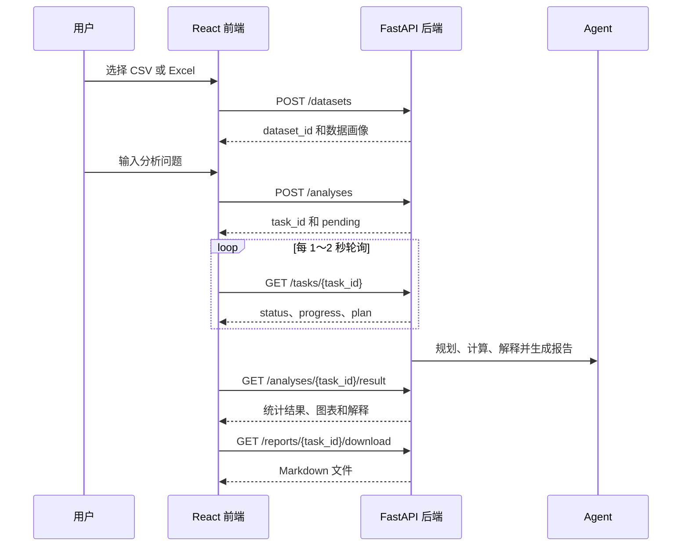

# Research Analysis Agent REST API 规范

> 文档版本：v1.0  
> API 版本：v1  
> 适用范围：Research Analysis Agent 第一版  
> 最后更新：2026-08-09

## 1. 文档说明

本文档规定 Research Analysis Agent 的前端与后端 REST API，包括接口路径、请求参数、响应字段、任务状态、错误格式和联调要求。

本文档是 React 前端、FastAPI 后端和 API 测试共同遵守的接口合同。接口实现发生变更时，应先修改本文档，再修改代码。

第一版 API 覆盖以下业务闭环：

1. 上传 CSV 或 Excel 数据集并获取数据画像。
2. 使用自然语言创建统计分析任务。
3. 轮询任务状态、进度和分析计划。
4. 获取统计结果、图表和文字解释。
5. 下载 Markdown 分析报告。

第一版不包含用户账户、权限系统、历史记录、数据库管理、WebSocket 和真实 HPC 集群接口。

## 2. 基础信息

### 2.1 基础地址

本地开发环境：

```text
http://localhost:8000/api/v1
```

本文档中的接口路径均省略上述基础地址。例如：

```http
POST /datasets
```

对应的完整地址为：

```text
http://localhost:8000/api/v1/datasets
```

### 2.2 接口清单

| 方法 | 路径 | 功能 | 成功状态码 | 后端模块 |
|---|---|---|---:|---|
| `POST` | `/datasets` | 上传数据集并生成数据画像 | `201` | `backend/api/upload.py` |
| `POST` | `/analyses` | 创建分析任务 | `202` | `backend/api/analysis.py` |
| `GET` | `/tasks/{task_id}` | 查询任务状态、计划和进度 | `200` | `backend/api/task.py` |
| `GET` | `/analyses/{task_id}/result` | 获取完整分析结果 | `200` | `backend/api/report.py` |
| `GET` | `/reports/{task_id}/download` | 下载 Markdown 报告 | `200` | `backend/api/report.py` |
| `GET` | `/figures/{task_id}/{file_name}` | 获取分析图表 | `200` | `backend/app.py` |

## 3. 通用约定

### 3.1 数据格式

- 普通请求和响应使用 `application/json`。
- 文件上传使用 `multipart/form-data`。
- JSON 与文本内容统一使用 UTF-8 编码。
- JSON 字段名称统一使用小写下划线命名法，例如 `dataset_id`。
- JSON 布尔值使用 `true` 或 `false`，空值使用 `null`。
- 统计数值使用 JSON number；无法表示或不适用的数值返回 `null`，不得返回 `NaN`、`Infinity` 或字符串形式的数字。
- 图表和报告只返回可访问的 API URL，不向前端暴露服务器绝对路径或 `outputs/` 内部路径。

### 3.2 时间格式

所有时间使用带时区的 ISO 8601 格式：

```json
{
  "created_at": "2026-08-09T10:30:00+08:00",
  "updated_at": "2026-08-09T10:30:05+08:00"
}
```

### 3.3 资源标识

资源标识由后端生成，前端不得自行构造。

| 字段 | 含义 | 示例 |
|---|---|---|
| `dataset_id` | 数据集唯一标识 | `ds_8f42c1a2` |
| `task_id` | 分析任务唯一标识 | `task_20260809_001` |
| `figure_id` | 图表唯一标识 | `fig_anova_boxplot` |

标识必须在当前系统中唯一。具体生成算法属于后端实现细节，不属于本 API 合同。

### 3.4 跨域约定

本地开发时，FastAPI 应允许配置的 React 开发地址访问，例如：

```text
http://localhost:5173
```

允许的方法至少包括 `GET` 和 `POST`，允许请求头至少包括 `Content-Type`。生产环境不得使用不受限制的任意来源配置。

### 3.5 统一错误响应

所有失败响应统一采用以下格式：

```json
{
  "status": "failed",
  "error_code": "COLUMN_NOT_FOUND",
  "message": "数据集中不存在字段 yield。",
  "details": {
    "column": "yield"
  },
  "request_id": "req_b934e2"
}
```

字段说明：

| 字段 | 类型 | 必定返回 | 说明 |
|---|---|---:|---|
| `status` | string | 是 | 错误响应固定为 `failed` |
| `error_code` | string | 是 | 稳定的机器可读错误码 |
| `message` | string | 是 | 可直接向用户展示的中文说明 |
| `details` | object 或 null | 是 | 补充信息；没有时为 `null` |
| `request_id` | string 或 null | 是 | 请求追踪 ID；未启用时为 `null` |

服务端日志可以记录异常堆栈和内部文件路径，但错误响应不得向前端返回 API Key、异常堆栈或服务器绝对路径。

## 4. 核心业务流程



推荐的前端页面流转：

```text
UploadPage → AnalysisPage → ResultPage
```

## 5. 公共数据结构

### 5.1 数据列信息 `ColumnProfile`

| 字段 | 类型 | 必定返回 | 说明 |
|---|---|---:|---|
| `name` | string | 是 | 原始列名 |
| `data_type` | string | 是 | `numeric`、`categorical`、`datetime`、`text` 或 `boolean` |
| `pandas_dtype` | string | 是 | pandas 识别的数据类型 |
| `missing_count` | integer | 是 | 缺失值数量 |
| `missing_ratio` | number | 是 | 缺失比例，范围为 0～1 |
| `unique_count` | integer | 是 | 去除缺失值后的唯一值数量 |
| `sample_values` | array | 是 | 最多 5 个非空示例值 |

示例：

```json
{
  "name": "yield",
  "data_type": "numeric",
  "pandas_dtype": "float64",
  "missing_count": 2,
  "missing_ratio": 0.0167,
  "unique_count": 108,
  "sample_values": [25.3, 27.1, 23.8]
}
```

### 5.2 分析计划 `AnalysisPlan`

| 字段 | 类型 | 必定返回 | 说明 |
|---|---|---:|---|
| `task_type` | string | 是 | 统计分析类型 |
| `target_column` | string 或 null | 是 | 因变量或目标变量 |
| `group_column` | string 或 null | 是 | 分组变量 |
| `feature_columns` | string[] | 是 | 解释变量或参与分析的字段 |
| `options` | object | 是 | 经后端校验后的分析参数 |
| `steps` | string[] | 是 | 前端展示的执行步骤 |

第一版允许的 `task_type`：

| 值 | 含义 |
|---|---|
| `descriptive` | 描述性统计 |
| `correlation` | 相关分析 |
| `t_test` | 独立样本 t 检验 |
| `anova` | 单因素方差分析 |
| `regression` | 线性或多元线性回归 |

示例：

```json
{
  "task_type": "anova",
  "target_column": "yield",
  "group_column": "fertilizer",
  "feature_columns": [],
  "options": {
    "alpha": 0.05
  },
  "steps": [
    "检查字段与数据类型",
    "处理分析字段中的缺失值",
    "计算分组描述性统计",
    "执行单因素方差分析",
    "生成分组箱线图",
    "解释统计结果"
  ]
}
```

### 5.3 结果表格 `ResultTable`

所有统计结果表统一使用 `columns + rows`，以便前端复用同一个表格组件。

| 字段 | 类型 | 必定返回 | 说明 |
|---|---|---:|---|
| `table_id` | string | 是 | 当前结果中的表格标识 |
| `title` | string | 是 | 表格标题 |
| `columns` | string[] | 是 | 列名，顺序与每一行一致 |
| `rows` | array[] | 是 | 二维数组；无结果时为空数组 |
| `notes` | string[] | 是 | 表格注释或为空数组 |

示例：

```json
{
  "table_id": "anova_result",
  "title": "单因素方差分析结果",
  "columns": ["source", "df", "f_statistic", "p_value"],
  "rows": [
    ["between_groups", 2, 8.42, 0.003]
  ],
  "notes": []
}
```

### 5.4 图表信息 `Figure`

| 字段 | 类型 | 必定返回 | 说明 |
|---|---|---:|---|
| `figure_id` | string | 是 | 图表标识 |
| `title` | string | 是 | 图表标题 |
| `type` | string | 是 | 图表类型，如 `boxplot` |
| `url` | string | 是 | 浏览器可访问的 API 相对 URL |
| `alt_text` | string | 是 | 图片无法显示时使用的说明文字 |

## 6. 上传数据集

### 6.1 接口定义

```http
POST /datasets
Content-Type: multipart/form-data
```

用途：上传 CSV、XLS 或 XLSX 文件，完成基础读取、字段识别和数据画像，并获得后续创建分析任务所需的 `dataset_id`。

### 6.2 请求参数

| 字段 | 位置 | 类型 | 必填 | 约束 | 说明 |
|---|---|---|---:|---|---|
| `file` | form-data | File | 是 | `.csv`、`.xls`、`.xlsx`；最大 20 MiB | 数据文件 |
| `sheet_name` | form-data | string | 否 | 仅 Excel 使用 | 指定工作表名称；不传时读取第一个工作表 |

前端上传示例：

```javascript
const formData = new FormData();
formData.append("file", file);

const response = await client.post("/datasets", formData, {
  headers: { "Content-Type": "multipart/form-data" }
});
```

### 6.3 成功响应

状态码：`201 Created`

```json
{
  "dataset_id": "ds_8f42c1a2",
  "status": "ready",
  "file_name": "fertilizer.csv",
  "file_type": "csv",
  "sheet_name": null,
  "file_size": 4832,
  "row_count": 120,
  "column_count": 3,
  "duplicate_row_count": 1,
  "columns": [
    {
      "name": "fertilizer",
      "data_type": "categorical",
      "pandas_dtype": "object",
      "missing_count": 0,
      "missing_ratio": 0.0,
      "unique_count": 3,
      "sample_values": ["A", "B", "C"]
    },
    {
      "name": "yield",
      "data_type": "numeric",
      "pandas_dtype": "float64",
      "missing_count": 2,
      "missing_ratio": 0.0167,
      "unique_count": 108,
      "sample_values": [25.3, 27.1, 23.8]
    }
  ],
  "preview": [
    {
      "fertilizer": "A",
      "yield": 25.3,
      "plot_id": 1
    },
    {
      "fertilizer": "B",
      "yield": 27.1,
      "plot_id": 2
    }
  ],
  "warnings": [
    "字段 yield 存在 2 个缺失值，分析时将按所选方法处理。"
  ],
  "created_at": "2026-08-09T10:30:00+08:00"
}
```

响应字段说明：

| 字段 | 类型 | 说明 |
|---|---|---|
| `dataset_id` | string | 数据集唯一标识 |
| `status` | string | 上传和画像成功时固定为 `ready` |
| `file_name` | string | 用户上传时的原始文件名，仅用于展示 |
| `file_type` | string | `csv`、`xls` 或 `xlsx` |
| `sheet_name` | string 或 null | 实际读取的 Excel 工作表；CSV 为 `null` |
| `file_size` | integer | 文件字节数 |
| `row_count` | integer | 数据行数，不含表头 |
| `column_count` | integer | 数据列数 |
| `duplicate_row_count` | integer | 完全重复的行数 |
| `columns` | ColumnProfile[] | 字段画像 |
| `preview` | object[] | 最多返回前 5 行，不足 5 行时全部返回 |
| `warnings` | string[] | 非阻断性问题；没有时为空数组 |
| `created_at` | string | 创建时间 |

### 6.4 失败响应

| HTTP 状态码 | `error_code` | 触发条件 |
|---:|---|---|
| `400` | `FILE_REQUIRED` | 未提供文件 |
| `400` | `INVALID_FILE_TYPE` | 文件扩展名或真实类型不受支持 |
| `400` | `EMPTY_DATASET` | 文件中没有可分析的数据行或列 |
| `400` | `FILE_PARSE_ERROR` | CSV 编码、分隔符或 Excel 内容无法解析 |
| `404` | `SHEET_NOT_FOUND` | 指定 Excel 工作表不存在 |
| `413` | `FILE_TOO_LARGE` | 文件超过 20 MiB |
| `500` | `PROFILE_FAILED` | 数据画像过程发生内部错误 |

错误示例：

```json
{
  "status": "failed",
  "error_code": "INVALID_FILE_TYPE",
  "message": "仅支持 CSV、XLS 和 XLSX 文件。",
  "details": {
    "allowed_extensions": ["csv", "xls", "xlsx"]
  },
  "request_id": "req_b934e2"
}
```

## 7. 创建分析任务

### 7.1 接口定义

```http
POST /analyses
Content-Type: application/json
```

用途：根据已上传的数据集和用户问题创建异步分析任务。接口只负责创建任务，不等待完整分析结束。

### 7.2 请求体

```json
{
  "dataset_id": "ds_8f42c1a2",
  "question": "不同肥料组的作物产量是否存在显著差异？",
  "options": {
    "alpha": 0.05
  }
}
```

字段说明：

| 字段 | 类型 | 必填 | 约束 | 说明 |
|---|---|---:|---|---|
| `dataset_id` | string | 是 | 必须是已上传且可用的数据集 | 数据集标识 |
| `question` | string | 是 | 去除首尾空格后 2～1000 个字符 | 自然语言分析问题 |
| `options` | object | 否 | 仅允许已定义参数 | 分析选项 |
| `options.alpha` | number | 否 | `0 < alpha < 1`，默认 `0.05` | 显著性水平 |

第一版由 Agent 根据问题和数据画像自动决定分析类型及字段，前端不需要提交 `task_type`、`target_column` 或 `group_column`。

### 7.3 成功响应

状态码：`202 Accepted`

```json
{
  "task_id": "task_20260809_001",
  "dataset_id": "ds_8f42c1a2",
  "status": "pending",
  "progress": 0,
  "message": "分析任务已创建。",
  "status_url": "/api/v1/tasks/task_20260809_001",
  "result_url": "/api/v1/analyses/task_20260809_001/result",
  "created_at": "2026-08-09T10:31:00+08:00"
}
```

### 7.4 失败响应

| HTTP 状态码 | `error_code` | 触发条件 |
|---:|---|---|
| `404` | `DATASET_NOT_FOUND` | `dataset_id` 不存在 |
| `409` | `DATASET_NOT_READY` | 数据集尚不可用于分析 |
| `422` | `INVALID_QUESTION` | 问题为空、过短或超过长度限制 |
| `422` | `INVALID_OPTION` | 分析选项格式或取值不合法 |
| `500` | `TASK_CREATE_FAILED` | 无法创建任务 |

## 8. 查询任务状态

### 8.1 接口定义

```http
GET /tasks/{task_id}
```

用途：供 `AnalysisProgress` 和 `AnalysisPlan` 组件轮询任务状态、进度、当前步骤与计划。

路径参数：

| 参数 | 类型 | 说明 |
|---|---|---|
| `task_id` | string | 创建分析任务时返回的任务标识 |

### 8.2 任务状态

状态值固定如下，前后端不得自行新增未写入本文档的状态：

| 状态 | 建议进度 | 含义 |
|---|---:|---|
| `pending` | 0 | 任务已创建，等待执行 |
| `profiling` | 5～15 | 校验数据画像或执行任务级数据准备 |
| `planning` | 15～30 | Agent 正在生成并校验分析计划 |
| `running` | 30～75 | 正在清洗数据、执行统计分析和绘图 |
| `interpreting` | 75～99 | 正在解释结果并生成报告 |
| `completed` | 100 | 任务成功完成 |
| `failed` | 保留失败前进度 | 任务执行失败 |

`progress` 是 0～100 的整数，用于界面展示，不代表精确的计算量。

允许的状态流转：

```text
pending → profiling → planning → running → interpreting → completed
                                                         ↘ failed
```

任意执行阶段都可以转为 `failed`。第一版不提供暂停、取消和重新执行接口。

### 8.3 运行中响应

状态码：`200 OK`

```json
{
  "task_id": "task_20260809_001",
  "dataset_id": "ds_8f42c1a2",
  "status": "running",
  "progress": 60,
  "current_step": "正在执行单因素方差分析",
  "plan": {
    "task_type": "anova",
    "target_column": "yield",
    "group_column": "fertilizer",
    "feature_columns": [],
    "options": {
      "alpha": 0.05
    },
    "steps": [
      "检查字段与数据类型",
      "处理分析字段中的缺失值",
      "计算分组描述性统计",
      "执行单因素方差分析",
      "生成分组箱线图",
      "解释统计结果"
    ]
  },
  "error": null,
  "created_at": "2026-08-09T10:31:00+08:00",
  "updated_at": "2026-08-09T10:31:08+08:00"
}
```

响应字段说明：

| 字段 | 类型 | 说明 |
|---|---|---|
| `task_id` | string | 任务标识 |
| `dataset_id` | string | 关联的数据集标识 |
| `status` | string | 当前任务状态 |
| `progress` | integer | 0～100 的整数 |
| `current_step` | string | 可直接展示的当前步骤 |
| `plan` | AnalysisPlan 或 null | `pending`、`profiling` 时通常为 `null` |
| `error` | object 或 null | 非失败状态为 `null` |
| `created_at` | string | 创建时间 |
| `updated_at` | string | 最近更新时间 |

### 8.4 完成响应

任务完成后，本接口仍只返回状态信息，不重复返回完整分析结果：

```json
{
  "task_id": "task_20260809_001",
  "dataset_id": "ds_8f42c1a2",
  "status": "completed",
  "progress": 100,
  "current_step": "分析完成",
  "plan": {
    "task_type": "anova",
    "target_column": "yield",
    "group_column": "fertilizer",
    "feature_columns": [],
    "options": {
      "alpha": 0.05
    },
    "steps": [
      "检查字段与数据类型",
      "处理分析字段中的缺失值",
      "计算分组描述性统计",
      "执行单因素方差分析",
      "生成分组箱线图",
      "解释统计结果"
    ]
  },
  "error": null,
  "result_url": "/api/v1/analyses/task_20260809_001/result",
  "created_at": "2026-08-09T10:31:00+08:00",
  "updated_at": "2026-08-09T10:31:15+08:00"
}
```

### 8.5 任务失败响应体

任务本身执行失败时，查询请求仍成功，因此 HTTP 状态码为 `200 OK`，任务状态为 `failed`：

```json
{
  "task_id": "task_20260809_001",
  "dataset_id": "ds_8f42c1a2",
  "status": "failed",
  "progress": 35,
  "current_step": "分析失败",
  "plan": {
    "task_type": "anova",
    "target_column": "yield",
    "group_column": "fertilizer",
    "feature_columns": [],
    "options": {
      "alpha": 0.05
    },
    "steps": [
      "检查字段与数据类型",
      "执行单因素方差分析"
    ]
  },
  "error": {
    "error_code": "METHOD_NOT_APPLICABLE",
    "message": "有效分组少于 2 组，无法执行单因素方差分析。",
    "details": {
      "valid_group_count": 1
    }
  },
  "created_at": "2026-08-09T10:31:00+08:00",
  "updated_at": "2026-08-09T10:31:04+08:00"
}
```

只有请求本身失败时才返回 4xx 或 5xx，例如：

| HTTP 状态码 | `error_code` | 触发条件 |
|---:|---|---|
| `404` | `TASK_NOT_FOUND` | `task_id` 不存在 |

### 8.6 前端轮询规则

1. 创建任务成功后立即开始轮询。
2. 建议每 1～2 秒请求一次，第一版推荐 1500 ms。
3. 收到 `completed` 后停止轮询并请求结果接口。
4. 收到 `failed` 后停止轮询并展示 `error.message`。
5. 单次网络请求失败时可重试，但不得重复调用创建任务接口。
6. 页面卸载时应清除定时器，避免重复请求。

## 9. 获取分析结果

### 9.1 接口定义

```http
GET /analyses/{task_id}/result
```

用途：任务完成后，返回 `ResultPage` 展示所需的结构化统计结果、图表、解释、警告和报告下载地址。

### 9.2 成功响应

状态码：`200 OK`

```json
{
  "task_id": "task_20260809_001",
  "dataset_id": "ds_8f42c1a2",
  "status": "completed",
  "question": "不同肥料组的作物产量是否存在显著差异？",
  "analysis_type": "anova",
  "method_name": "单因素方差分析",
  "data_summary": {
    "original_row_count": 120,
    "used_row_count": 118,
    "excluded_row_count": 2,
    "cleaning_notes": [
      "删除 yield 字段中包含缺失值的 2 行记录。"
    ]
  },
  "plan": {
    "task_type": "anova",
    "target_column": "yield",
    "group_column": "fertilizer",
    "feature_columns": [],
    "options": {
      "alpha": 0.05
    },
    "steps": [
      "检查字段与数据类型",
      "处理分析字段中的缺失值",
      "计算分组描述性统计",
      "执行单因素方差分析",
      "生成分组箱线图",
      "解释统计结果"
    ]
  },
  "summary": {
    "f_statistic": 8.42,
    "p_value": 0.003,
    "alpha": 0.05,
    "significant": true
  },
  "tables": [
    {
      "table_id": "anova_result",
      "title": "单因素方差分析结果",
      "columns": ["source", "df", "f_statistic", "p_value"],
      "rows": [
        ["between_groups", 2, 8.42, 0.003]
      ],
      "notes": []
    }
  ],
  "figures": [
    {
      "figure_id": "fig_anova_boxplot",
      "title": "不同肥料组的产量分布",
      "type": "boxplot",
      "url": "/api/v1/figures/task_20260809_001/anova_boxplot.png",
      "alt_text": "肥料 A、B、C 三组作物产量的箱线图"
    }
  ],
  "interpretation": "在显著性水平 0.05 下，不同肥料组的平均产量存在统计显著差异。该结果表明至少有一组均值不同，但不能仅凭本结果判断具体哪些组存在差异，也不能直接推断因果关系。",
  "warnings": [
    "ANOVA 显著时，如需判断具体组间差异，应进一步进行事后多重比较。"
  ],
  "report_download_url": "/api/v1/reports/task_20260809_001/download",
  "completed_at": "2026-08-09T10:31:15+08:00"
}
```

顶层字段说明：

| 字段 | 类型 | 必定返回 | 说明 |
|---|---|---:|---|
| `task_id` | string | 是 | 任务标识 |
| `dataset_id` | string | 是 | 数据集标识 |
| `status` | string | 是 | 成功获取结果时固定为 `completed` |
| `question` | string | 是 | 用户原始问题 |
| `analysis_type` | string | 是 | 与计划中的 `task_type` 一致 |
| `method_name` | string | 是 | 用于界面展示的中文方法名称 |
| `data_summary` | object | 是 | 实际参与分析的数据情况 |
| `plan` | AnalysisPlan | 是 | 最终执行的分析计划 |
| `summary` | object | 是 | 不同方法的核心指标，字段随分析类型变化 |
| `tables` | ResultTable[] | 是 | 没有表格时为空数组 |
| `figures` | Figure[] | 是 | 没有图表时为空数组 |
| `interpretation` | string | 是 | LLM 基于统计结果生成的解释 |
| `warnings` | string[] | 是 | 假设、限制及非阻断性问题 |
| `report_download_url` | string | 是 | 报告下载地址 |
| `completed_at` | string | 是 | 完成时间 |

### 9.3 `summary` 约定

`summary` 保存不同方法最重要的机器可读指标。第一版至少遵守以下字段：

| `analysis_type` | 主要字段 |
|---|---|
| `descriptive` | `variable_count`、`observation_count` |
| `correlation` | `method`、`coefficient`、`p_value`、`alpha`、`significant` |
| `t_test` | `t_statistic`、`degrees_of_freedom`、`p_value`、`alpha`、`significant` |
| `anova` | `f_statistic`、`p_value`、`alpha`、`significant` |
| `regression` | `r_squared`、`adjusted_r_squared`、`f_statistic`、`f_p_value`、`observation_count` |

更详细的指标应放入 `tables`，避免前端针对每种分析结果硬编码大量顶层字段。

### 9.4 失败响应

| HTTP 状态码 | `error_code` | 触发条件 |
|---:|---|---|
| `404` | `TASK_NOT_FOUND` | 任务不存在 |
| `409` | `TASK_NOT_COMPLETED` | 任务仍在执行或已经失败，没有可用结果 |
| `500` | `RESULT_READ_FAILED` | 结果文件无法读取 |

任务未完成示例：

```json
{
  "status": "failed",
  "error_code": "TASK_NOT_COMPLETED",
  "message": "分析任务尚未完成。",
  "details": {
    "task_id": "task_20260809_001",
    "task_status": "running"
  },
  "request_id": "req_d138f0"
}
```

## 10. 下载分析报告

### 10.1 接口定义

```http
GET /reports/{task_id}/download
```

用途：下载任务生成的 Markdown 分析报告。

### 10.2 成功响应

状态码：`200 OK`

响应头：

```http
Content-Type: text/markdown; charset=utf-8
Content-Disposition: attachment; filename="analysis_report_{task_id}.md"
```

响应体为 Markdown 文件字节流，不使用 JSON 包装。

报告至少包含：

1. 用户分析问题。
2. 数据集概况。
3. 数据清洗说明。
4. 分析计划。
5. 分析方法与适用条件。
6. 统计结果。
7. 可视化图表。
8. 结果解释。
9. 警告与分析限制。

### 10.3 失败响应

| HTTP 状态码 | `error_code` | 触发条件 |
|---:|---|---|
| `404` | `TASK_NOT_FOUND` | 任务不存在 |
| `404` | `REPORT_NOT_FOUND` | 任务已完成但报告文件不存在 |
| `409` | `TASK_NOT_COMPLETED` | 任务尚未完成 |
| `500` | `REPORT_READ_FAILED` | 报告文件读取失败 |

失败时返回 `application/json` 格式的统一错误响应。

## 11. 获取分析图表

### 11.1 接口定义

```http
GET /figures/{task_id}/{file_name}
```

用途：通过后端受控路由向前端提供分析图表。前端只能使用结果接口返回的 `url`，不得自行拼接服务器路径。

路径参数：

| 参数 | 类型 | 约束 | 说明 |
|---|---|---|---|
| `task_id` | string | 必须对应已有任务 | 任务标识 |
| `file_name` | string | 仅允许后端生成的安全文件名 | 图表文件名 |

成功响应：

```http
HTTP/1.1 200 OK
Content-Type: image/png
```

第一版默认使用 PNG。后端必须阻止 `..`、斜杠、反斜杠等路径穿越内容，且只允许访问当前任务图表目录中的白名单文件。

失败响应：

| HTTP 状态码 | `error_code` | 触发条件 |
|---:|---|---|
| `400` | `INVALID_FILE_NAME` | 文件名不安全或格式不允许 |
| `404` | `TASK_NOT_FOUND` | 任务不存在 |
| `404` | `FIGURE_NOT_FOUND` | 图表不存在 |

## 12. 错误码总表

| 错误码 | HTTP 状态码 | 含义 |
|---|---:|---|
| `FILE_REQUIRED` | 400 | 未上传文件 |
| `INVALID_FILE_TYPE` | 400 | 文件格式不支持 |
| `EMPTY_DATASET` | 400 | 数据集为空 |
| `FILE_PARSE_ERROR` | 400 | 数据文件无法解析 |
| `INVALID_FILE_NAME` | 400 | 资源文件名不安全 |
| `SHEET_NOT_FOUND` | 404 | Excel 工作表不存在 |
| `DATASET_NOT_FOUND` | 404 | 数据集不存在 |
| `TASK_NOT_FOUND` | 404 | 分析任务不存在 |
| `REPORT_NOT_FOUND` | 404 | 报告文件不存在 |
| `FIGURE_NOT_FOUND` | 404 | 图表文件不存在 |
| `DATASET_NOT_READY` | 409 | 数据集尚不可用于分析 |
| `TASK_NOT_COMPLETED` | 409 | 分析任务尚未成功完成 |
| `FILE_TOO_LARGE` | 413 | 文件超过大小限制 |
| `INVALID_QUESTION` | 422 | 分析问题不合法 |
| `INVALID_OPTION` | 422 | 分析选项不合法 |
| `COLUMN_NOT_FOUND` | 422 | 计划引用的字段不存在 |
| `INVALID_COLUMN_TYPE` | 422 | 字段数据类型不满足要求 |
| `INSUFFICIENT_DATA` | 422 | 有效样本数量不足 |
| `METHOD_NOT_APPLICABLE` | 422 | 数据不适用所选统计方法 |
| `TASK_CREATE_FAILED` | 500 | 创建任务失败 |
| `PROFILE_FAILED` | 500 | 数据画像失败 |
| `ANALYSIS_FAILED` | 500 | 统计分析或绘图失败 |
| `RESULT_READ_FAILED` | 500 | 结果读取失败 |
| `REPORT_READ_FAILED` | 500 | 报告读取失败 |
| `LLM_SERVICE_ERROR` | 502 | 大语言模型服务调用失败 |
| `LLM_RESPONSE_INVALID` | 502 | 大语言模型返回格式不合法 |

业务校验错误可以发生在异步任务内部。此时任务状态变为 `failed`，错误信息通过任务状态接口的 `error` 字段返回，而不是将后台执行阶段的状态码直接返回给已经结束的 `POST /analyses` 请求。

## 13. 后端实现映射

| API | 路由职责 | Pydantic 模型建议 | 主要调用模块 |
|---|---|---|---|
| `POST /datasets` | 接收文件、校验并生成画像 | `DatasetUploadResponse` | `loader.py`、`profiler.py` |
| `POST /analyses` | 校验请求并创建任务 | `AnalysisCreateRequest`、`AnalysisCreateResponse` | `state_manager.py`、`main_agent.py` |
| `GET /tasks/{task_id}` | 读取任务状态 | `TaskStatusResponse` | `state_manager.py` |
| `GET /analyses/{task_id}/result` | 组装完整结果 | `AnalysisResultResponse` | `state_manager.py`、报告结果文件 |
| `GET /reports/{task_id}/download` | 返回 Markdown 文件 | 文件响应 | 报告文件 |
| `GET /figures/{task_id}/{file_name}` | 返回 PNG 文件 | 文件响应 | 图表文件 |

建议将公共结构和错误结构定义在：

```text
backend/schemas/request.py
backend/schemas/response.py
```

API 路由层只负责：

- 读取和校验请求。
- 调用 Agent、状态管理器或数据处理模块。
- 将内部结果转换为本文档规定的响应格式。
- 选择正确的 HTTP 状态码。

API 路由层不得直接实现统计计算，也不得直接调用 LLM。

## 14. 前端调用约定

所有 HTTP 请求统一封装在：

```text
frontend/src/api/client.js
```

建议提供以下函数：

```javascript
export const uploadDataset = (formData) =>
  client.post("/datasets", formData);

export const createAnalysis = (payload) =>
  client.post("/analyses", payload);

export const getTaskStatus = (taskId) =>
  client.get(`/tasks/${taskId}`);

export const getAnalysisResult = (taskId) =>
  client.get(`/analyses/${taskId}/result`);

export const getReportDownloadUrl = (taskId) =>
  `${client.defaults.baseURL}/reports/${taskId}/download`;
```

组件与接口对应关系：

| 前端页面或组件 | 使用接口 |
|---|---|
| `FileUploader`、`UploadPage` | `POST /datasets` |
| `AnalysisPage` | `POST /analyses` |
| `AnalysisProgress`、`AnalysisPlan` | `GET /tasks/{task_id}` |
| `ResultPage`、`ResultTable`、`ChartViewer` | `GET /analyses/{task_id}/result` |
| `ReportDownload` | `GET /reports/{task_id}/download` |

前端错误展示规则：

1. 优先显示后端返回的 `message`。
2. 网络异常且没有标准错误体时，显示统一提示“网络请求失败，请稍后重试”。
3. 不根据中文错误文字判断业务类型，应使用 `error_code`。
4. 不读取本文档未定义的响应字段。

## 15. 测试与验收

`tests/test_api.py` 至少覆盖以下场景：

### 15.1 上传接口

- 成功上传 CSV。
- 成功上传 XLSX。
- 拒绝不支持的文件格式。
- 拒绝空数据集。
- 拒绝超过大小限制的文件。
- 正确返回列类型、缺失值和最多 5 行预览。

### 15.2 创建任务接口

- 使用有效 `dataset_id` 和问题成功创建任务。
- 不存在的数据集返回 `DATASET_NOT_FOUND`。
- 空问题返回 `INVALID_QUESTION`。
- 非法 `alpha` 返回 `INVALID_OPTION`。

### 15.3 状态接口

- 不存在的任务返回 `TASK_NOT_FOUND`。
- `progress` 始终为 0～100 的整数。
- 状态值只取本文档规定的枚举。
- `completed` 时 `progress` 为 100 且包含 `result_url`。
- 后台失败时 HTTP 状态码仍为 200，响应中的任务状态为 `failed`。

### 15.4 结果和文件接口

- 未完成任务请求结果返回 `TASK_NOT_COMPLETED`。
- 完成任务返回结构化 `tables` 和 `figures`。
- 报告下载响应头正确。
- 图表 URL 可以访问且返回 `image/png`。
- 路径穿越文件名被拒绝。

### 15.5 最小端到端用例

使用 `examples/fertilizer_anova/` 完成：

```text
上传 fertilizer.csv
→ 提交“不同肥料组的作物产量是否存在显著差异？”
→ 轮询至 completed
→ 获取 ANOVA 结果和箱线图
→ 下载 Markdown 报告
```

## 16. 前后端联调规则

1. 后端不得擅自修改接口路径、字段名称、字段类型或状态值。
2. 前端不得根据猜测访问本文档未定义的字段。
3. 新增或修改接口时，先更新 `docs/api_spec.md`，再修改实现和测试。
4. 后端接口应先通过 FastAPI 自动文档 `/docs` 和 `tests/test_api.py` 验证。
5. 前端统一通过 `frontend/src/api/client.js` 调用接口，不在组件内硬编码后端基础地址。
6. 所有成功响应、错误响应、时间、ID 和任务状态必须遵守本文档。
7. 后端内部文件路径不得出现在 API 响应中。
8. LLM 生成的计划必须先经过 Pydantic 和业务规则校验，才能进入统计 Skill。
9. 统计结果由 Python Skill 计算；LLM 只能规划和解释，不得修改统计数值。
10. 第一版若需要变更合同，应由前端、后端和测试负责人共同确认。

## 17. 版本变更记录

| 版本 | 日期 | 说明 |
|---|---|---|
| `v1.0` | 2026-08-09 | 定义第一版数据上传、任务创建、状态轮询、结果获取、图表访问和报告下载接口 |
