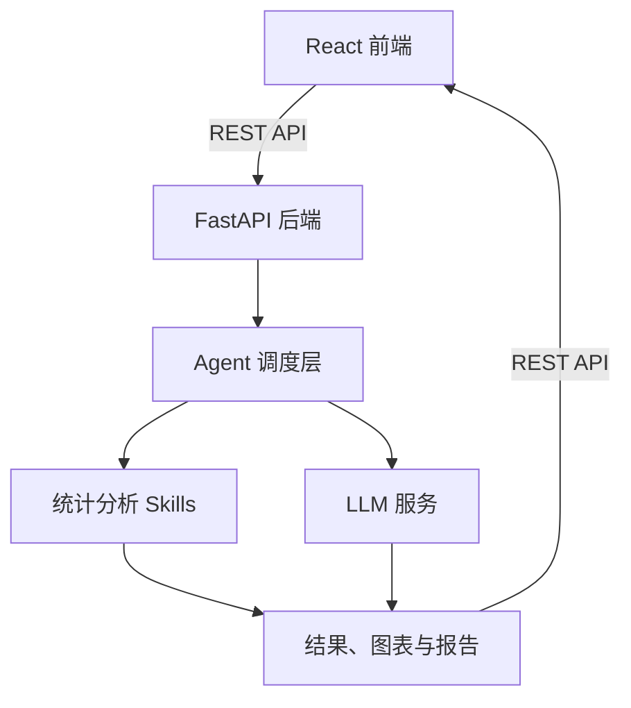
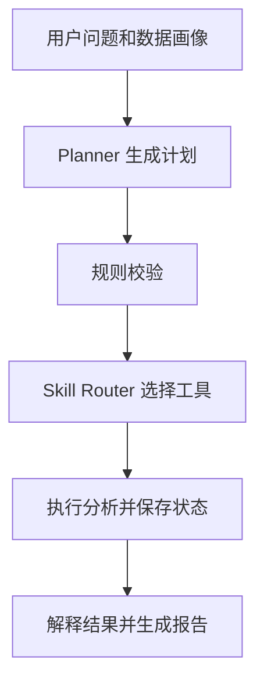
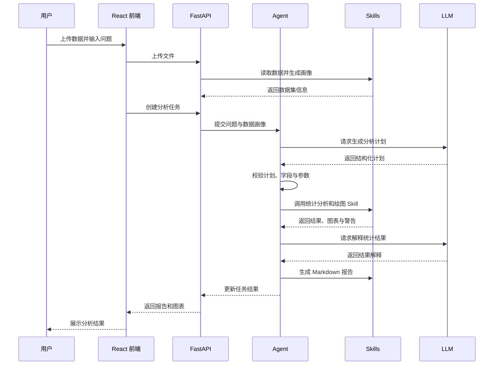

# Research Analysis Agent 系统架构说明

## 1. 项目概述

Research Analysis Agent 是一个面向结构化数据的统计分析智能体。用户上传 CSV 或 Excel 数据集，并使用自然语言描述分析需求；系统自动读取数据、生成数据画像、规划统计分析步骤、调用对应的统计分析 Skill，最终生成统计结果、可视化图表和 Markdown 分析报告。

本项目对应智能体课程大作业，采用 2—4 人团队开发。项目属于“基于智能体技术开展应用开发”方向，最终成果用于课程报告与答辩展示。

第一版主要支持：

- 描述性统计
- 相关分析
- 独立样本 t 检验
- 单因素方差分析（ANOVA）
- 线性回归与多元线性回归

本项目不训练新的大语言模型，而是通过 API 调用已有大语言模型，使其负责分析规划和结果解释。

## 2. 系统目标

系统需要完成以下闭环：

1. 用户上传结构化数据。
2. 系统识别字段名称、数据类型和缺失情况。
3. 用户使用自然语言提出分析问题。
4. Agent 根据数据特征和用户问题生成分析计划。
5. Agent 调用对应的统计分析 Skill。
6. 系统生成结构化统计结果和可视化图表。
7. 大语言模型解释统计结果。
8. 系统生成可阅读、可下载的分析报告。

## 3. 总体架构

系统采用前后端分离架构，主要由前端交互层、API 服务层、Agent 调度层、Skill 工具层和 LLM 服务层组成。



| 层级 | 主要职责 | 对应目录 |
|---|---|---|
| 前端交互层 | 文件上传、问题输入、进度和结果展示 | `frontend/` |
| API 服务层 | 接收请求、参数校验、任务管理、返回结果 | `backend/api/` |
| Agent 调度层 | 制定分析计划、选择 Skill、控制执行流程 | `backend/agent/` |
| LLM 服务层 | 统一调用模型完成规划和结果解释 | `backend/llm/` |
| Skill 工具层 | 数据处理、统计计算、绘图和报告生成 | `skills/` |

系统的核心设计原则是：

> LLM 负责规划和解释，Python Skill 负责真实计算，FastAPI 负责连接各模块，React 负责与用户交互。

## 4. 前端交互层

前端使用 React 和 Vite 开发，通过 REST API 与 FastAPI 后端通信。

### 4.1 主要页面

| 页面 | 职责 |
|---|---|
| `UploadPage.jsx` | 上传 CSV 或 Excel 文件，显示上传状态和数据集基本信息 |
| `AnalysisPage.jsx` | 输入自然语言问题，展示分析计划和执行进度 |
| `ResultPage.jsx` | 展示统计表格、图表、分析结论并提供报告下载 |

### 4.2 主要组件

| 组件 | 功能 |
|---|---|
| `FileUploader` | 文件选择和上传 |
| `AnalysisPlan` | 展示 Agent 生成的分析步骤 |
| `AnalysisProgress` | 展示任务当前状态 |
| `ResultTable` | 展示结构化统计结果 |
| `ChartViewer` | 展示系统生成的图表 |
| `ReportDownload` | 下载 Markdown 报告 |

前端通过 `frontend/src/api/client.js` 统一调用后端接口，页面和组件不得分别硬编码后端地址。

## 5. API 服务层

后端使用 FastAPI 开发，负责连接前端、Agent 和统计分析 Skills。后端 API 只负责请求处理、参数校验和流程组织，不直接实现具体统计计算。

| API 模块 | 功能 |
|---|---|
| `upload.py` | 接收 CSV 或 Excel 文件并返回文件标识和数据画像 |
| `analysis.py` | 根据数据集和用户问题创建分析任务 |
| `task.py` | 根据 `task_id` 查询任务状态和进度 |
| `report.py` | 获取分析结果、图表地址和报告 |

`backend/schemas/` 使用 Pydantic 定义统一的数据格式，包括：

- 创建分析任务的请求格式
- 文件上传后的响应格式
- 任务状态响应格式
- 统计结果响应格式
- 错误信息响应格式

前后端之间的具体路径、字段和状态码以 `docs/api_spec.md` 为准。

## 6. Agent 调度层

Agent 是系统的核心控制模块，负责理解用户问题并组织分析流程。



### 6.1 Main Agent

`backend/agent/main_agent.py` 是 Agent 的统一入口，负责：

1. 接收用户问题、数据路径和数据画像。
2. 调用 Planner 生成结构化分析计划。
3. 校验分析类型、字段名称和参数。
4. 将合法步骤交给 Skill Router。
5. 按顺序执行数据处理、统计分析和可视化 Skill。
6. 收集统计结果、警告信息和图表路径。
7. 调用结果解释模块。
8. 生成最终报告并更新任务状态。

### 6.2 Planner

`backend/agent/planner.py` 调用大语言模型，将用户的自然语言问题转换为结构化计划。Planner 只负责制定计划，不直接执行 Python 统计代码。

例如，用户输入：

> 不同肥料组的作物产量是否存在显著差异？

Planner 可以输出：

```json
{
  "task_type": "anova",
  "target_column": "yield",
  "group_column": "fertilizer",
  "options": {
    "alpha": 0.05
  },
  "steps": [
    "检查字段与数据类型",
    "处理分析字段中的缺失值",
    "计算分组描述性统计",
    "执行单因素方差分析",
    "生成分组箱线图",
    "解释统计结果"
  ]
}
```

### 6.3 Skill Router

`backend/agent/skill_router.py` 根据 `task_type` 从白名单中选择对应 Skill。

| `task_type` | 调用的 Skill |
|---|---|
| `descriptive` | `skills/statistics/descriptive.py` |
| `correlation` | `skills/statistics/correlation.py` |
| `t_test` | `skills/statistics/t_test.py` |
| `anova` | `skills/statistics/anova.py` |
| `regression` | `skills/statistics/regression.py` |

白名单机制用于防止大语言模型生成并执行任意 Python 代码。LLM 输出的 Skill 名称、字段和参数必须经过后端校验后才能执行。

### 6.4 State Manager

`backend/agent/state_manager.py` 保存任务状态、当前步骤和中间结果。

| 状态 | 含义 |
|---|---|
| `pending` | 任务已创建，等待执行 |
| `profiling` | 正在读取数据并生成数据画像 |
| `planning` | 正在生成分析计划 |
| `running` | 正在执行统计分析和绘图 |
| `interpreting` | 正在解释统计结果 |
| `completed` | 任务成功完成 |
| `failed` | 任务执行失败 |

第一版可使用内存字典或 JSON 文件保存状态，不引入 Redis、Celery 或数据库。

## 7. Skill 工具层

Skill 是可以被 Agent 调用的确定性 Python 函数。大语言模型负责决定“做什么”，Skill 负责准确完成“怎么计算”。所有 Skill 的输入输出规范以 `docs/skill_spec.md` 为准。

### 7.1 数据处理 Skill

`skills/data/` 负责：

- 读取 CSV、XLS 和 XLSX 文件
- 识别数值型、分类型和文本型字段
- 统计缺失值和重复值
- 完成基础数据清洗
- 生成数据画像

### 7.2 方法选择 Skill

`skills/selector/method_selector.py` 根据用户问题、字段类型和变量数量推荐统计方法。方法选择优先采用明确规则：

| 数据关系 | 推荐方法 |
|---|---|
| 一个连续变量与一个二分类变量 | 独立样本 t 检验 |
| 一个连续变量与一个多分类变量 | 单因素 ANOVA |
| 两个连续变量 | 相关分析 |
| 一个连续因变量与一个或多个解释变量 | 线性或多元线性回归 |

LLM 的判断结果必须经过规则校验；当字段类型不满足要求时，系统应拒绝执行并返回明确提示。

### 7.3 统计分析 Skill

统一输入示例：

```json
{
  "data_path": "outputs/uploads/example.csv",
  "target_column": "yield",
  "group_column": "fertilizer",
  "options": {
    "alpha": 0.05
  }
}
```

统一输出示例：

```json
{
  "skill_name": "anova",
  "status": "success",
  "summary": {
    "f_statistic": 8.42,
    "p_value": 0.003,
    "alpha": 0.05
  },
  "tables": [],
  "figures": [
    "outputs/figures/task_id/anova_boxplot.png"
  ],
  "warnings": []
}
```

统一格式可以降低 Agent、报告模块和前端之间的耦合。

### 7.4 可视化 Skill

`skills/visualization/figure_generator.py` 根据分析类型生成图表：

| 分析类型 | 默认图表 |
|---|---|
| 描述性统计 | 直方图或条形图 |
| 相关分析 | 散点图或相关系数热力图 |
| t 检验 | 分组箱线图 |
| ANOVA | 多组箱线图 |
| 回归分析 | 拟合图和残差图 |

图表统一保存至 `outputs/figures/{task_id}/`。

## 8. LLM 服务层

`backend/llm/client.py` 统一封装大语言模型 API。其他模块不得直接调用模型 API，以便集中处理模型名称、API 地址、超时、重试和错误信息，并方便后续更换模型服务。

大语言模型主要承担两项任务：

### 8.1 分析规划

模型根据以下信息生成结构化分析计划：

- 用户分析问题
- 数据字段名称及类型
- 数据画像
- 系统支持的 Skill 列表
- Skill 的参数约束

### 8.2 结果解释

模型将结构化统计结果转换为普通用户可以理解的文字，包括：

- 使用了什么方法
- 核心指标代表什么
- 结果是否具有统计显著性
- 在当前数据范围内可以得出什么结论
- 分析存在哪些假设、限制和风险

LLM 不得修改 Skill 已经计算出的统计数值，也不得把统计显著误写为实际影响巨大或因果关系成立。

## 9. 报告生成

报告模块位于 `skills/report/`。

- `result_interpreter.py`：调用 LLM 解释结构化统计结果。
- `report_generator.py`：将问题、数据概况、分析计划、统计结果、图表、解释和限制组合成 Markdown 报告。

最终报告至少包含：

1. 用户分析问题
2. 数据集概况
3. 数据清洗说明
4. 分析计划
5. 分析方法与适用条件
6. 统计结果
7. 可视化图表
8. 结果解释
9. 警告与分析限制

报告保存至 `outputs/reports/{task_id}/report.md`。

## 10. 完整业务流程



前端创建任务后，通过 `task_id` 定时查询任务状态。第一版不要求 WebSocket；使用简单轮询即可完成进度展示。

## 11. 文件与结果存储

第一版不使用复杂数据库，采用本地文件系统保存上传文件和分析产物。每次分析任务生成唯一的 `task_id`，不同任务的文件按目录隔离，避免相互覆盖。

```text
outputs/
├── uploads/
│   └── {task_id}/data.csv
├── figures/
│   └── {task_id}/anova_boxplot.png
└── reports/
    └── {task_id}/report.md
```

`outputs/` 不提交至 Git。演示数据放在 `examples/` 和 `tests/test_data/` 中。

## 12. 异常处理

系统需要处理：

- 文件格式不支持或文件过大
- CSV 编码错误
- Excel 工作表为空
- 用户指定字段不存在
- 字段类型不适合所选方法
- 有效样本数量不足
- 数据全部为缺失值
- 分析所需统计假设不满足
- LLM API 调用失败或返回格式错误
- 统计计算、图表生成或报告生成失败

API 使用统一错误格式：

```json
{
  "status": "failed",
  "error_code": "COLUMN_NOT_FOUND",
  "message": "数据集中不存在字段 yield。"
}
```

错误响应应面向用户说明原因，同时在服务端日志中保留便于开发者排查的详细信息。

## 13. 安全与可靠性

- 只允许上传 CSV、XLS 和 XLSX 文件。
- 限制上传文件大小，并验证真实文件类型。
- 上传文件使用系统生成的名称，避免路径穿越和同名覆盖。
- Skill Router 只调用已注册的白名单 Skill。
- 不允许 LLM 直接执行任意 Python 代码。
- API Key 通过 `.env` 配置，不提交至 GitHub。
- 所有统计数值由 Python 统计库计算，LLM 只负责规划和解释。
- Planner 输出必须经过 Pydantic 和业务规则双重校验。
- 报告中保留警告、统计假设和分析限制。

## 14. 技术选型

| 模块 | 技术 |
|---|---|
| 前端 | React、Vite、Axios |
| 后端 | FastAPI、Uvicorn、Pydantic |
| 数据处理 | pandas、NumPy |
| 统计分析 | SciPy、statsmodels、scikit-learn |
| 可视化 | Matplotlib、Seaborn |
| LLM 调用 | OpenAI 兼容 API |
| 测试 | pytest |
| 报告 | Markdown |

本项目不依赖 OpenClaw。Agent 的规划、工具路由和状态管理均由项目自身的 Python 模块完成。

## 15. 第一版范围

为保证团队能在有限时间内完成可演示系统，第一版重点实现：

- CSV、Excel 文件上传
- 数据画像和基础清洗
- 5 类统计分析方法
- Agent 自动规划与 Skill 路由
- 统计图表生成
- LLM 结果解释
- Markdown 报告生成
- 前端展示完整分析流程
- 关键模块单元测试和端到端演示

第一版暂不实现：

- 用户账户和权限系统
- 数据库持久化
- 分布式任务队列
- 真正的 HPC 集群提交
- 复杂机器学习训练
- 多智能体协作
- 任意 Python 代码执行
- PDF、Word 等非结构化数据解析

`skills/compute/` 在第一版中只保留 `local / HPC` 资源选择接口和模拟返回，用于展示后续扩展能力。

## 16. 模块依赖约束

为避免四人协作时出现循环依赖，代码应遵循以下规则：

1. 前端只能通过 REST API 访问后端，不能直接读取 `outputs/`。
2. API 层可以调用 Agent 和数据画像模块，但不实现统计算法。
3. Agent 可以调用 LLM 客户端和 Skill Router，但不直接依赖前端代码。
4. Skill 不依赖 FastAPI，也不读取前端状态。
5. 统计 Skill 不直接调用 LLM。
6. 报告模块只消费结构化结果，不重新计算统计指标。
7. 所有跨模块数据必须符合 `api_spec.md` 或 `skill_spec.md` 中的约定。

以上约束使每位成员可以围绕稳定接口并行开发，并减少后期集成成本。
