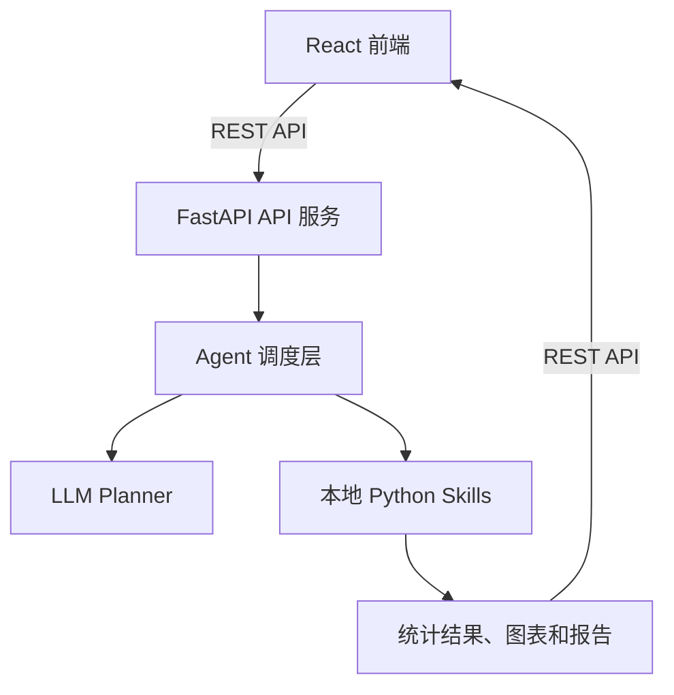
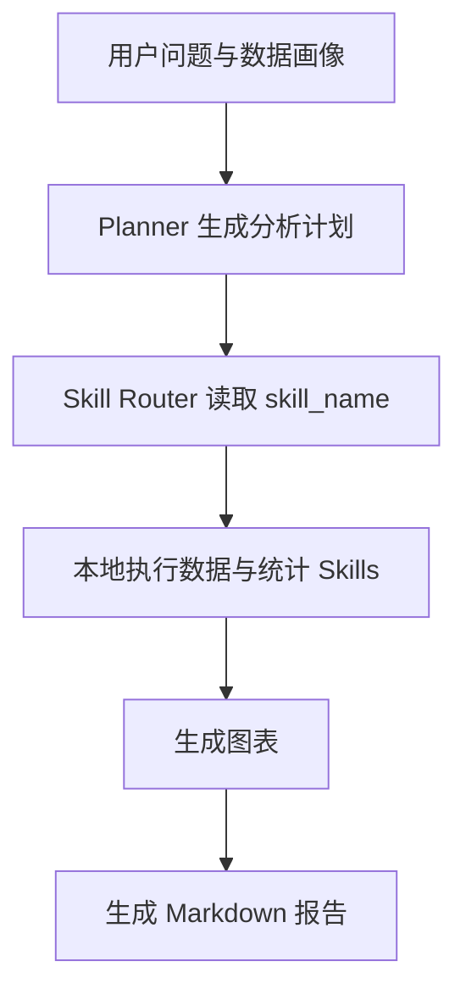
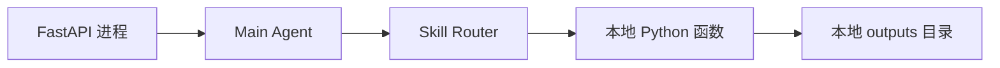
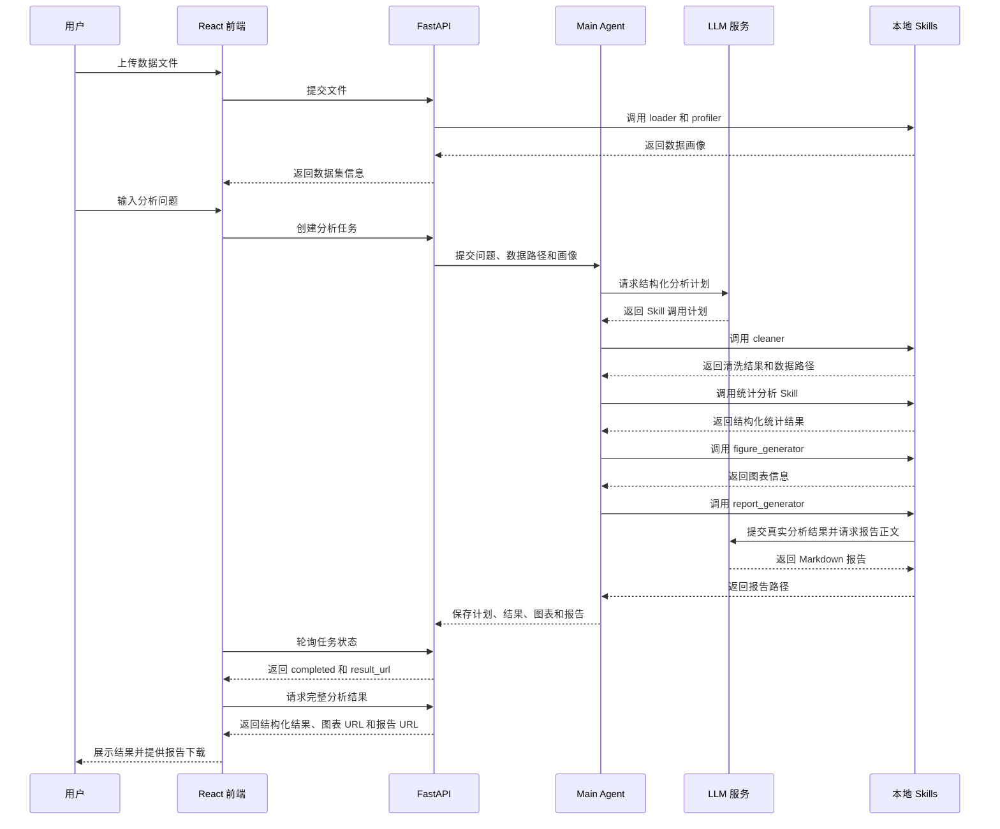
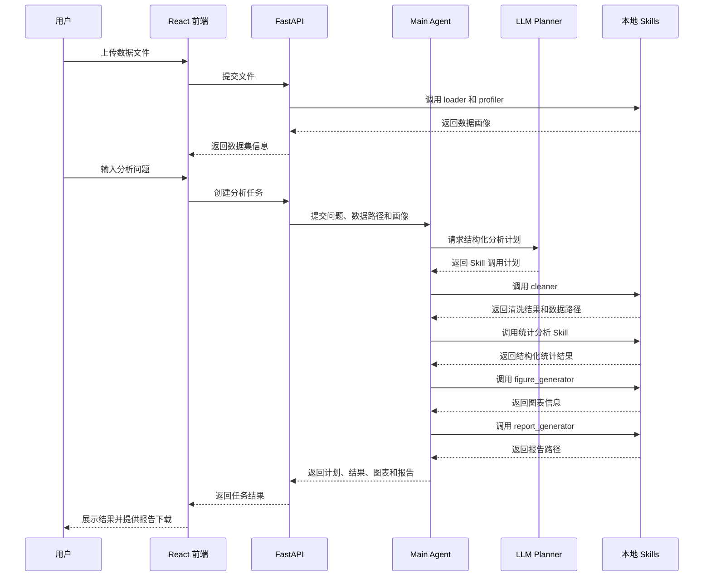

# Research Analysis Agent 系统架构说明（第二版）

## 1. 项目概述

Research Analysis Agent 是一个面向结构化数据的统计分析智能体。用户上传 CSV 或 Excel 数据集，并使用自然语言描述分析需求；系统自动读取和清洗数据、生成数据画像、规划统计分析步骤、调用对应的统计分析 Skill，最终生成统计结果、可视化图表和 Markdown 分析报告。

本项目对应智能体课程大作业，属于“基于智能体技术开展应用开发”方向。系统不训练新的大语言模型，而是通过 API 调用已有大语言模型生成分析计划和 Markdown 报告；数据处理、统计计算与绘图由本地 Python 程序完成。

第二版支持以下统计分析：

- 描述性统计
- 相关分析
- 独立样本 t 检验
- 线性回归与多元线性回归

第二版采用简化的本地执行设计，同时保留上传失败、请求失败和后台任务失败的错误展示流程。HTTP 请求错误使用 FastAPI 的 `detail` 字段，后台执行错误通过任务状态接口的 `error.message` 返回。

---

## 2. 系统目标

系统需要完成以下闭环：

1. 用户上传 CSV、XLS 或 XLSX 数据文件。
2. 系统读取数据并生成字段类型、缺失值、重复值等数据画像。
3. 用户使用自然语言提出统计分析问题。
4. Planner 根据用户问题和数据画像生成结构化分析计划。
5. Skill Router 按计划调用数据处理、统计分析和可视化 Skill。
6. 系统汇总已有结果并生成 Markdown 分析报告。
7. 前端展示分析计划、统计结果、图表和报告下载入口。

---

## 3. 总体架构

系统采用前后端分离架构，主要由前端交互层、API 服务层、Agent 调度层、LLM 服务层和 Skill 工具层组成。



| 层级 | 主要职责 | 对应目录 |
|---|---|---|
| 前端交互层 | 文件上传、问题输入、进度和结果展示 | `frontend/` |
| API 服务层 | 接收请求、管理任务、返回分析结果 | `backend/api/` |
| Agent 调度层 | 组织分析流程、调用 Planner 和 Skill Router | `backend/agent/` |
| LLM 服务层 | 调用大语言模型生成结构化分析计划和 Markdown 报告 | `backend/llm/`、`skills/report/` |
| Skill 工具层 | 在本地完成数据处理、统计分析、绘图和报告生成 | `skills/` |

系统的核心原则是：

> LLM 负责决定“做什么”，本地 Python Skill 负责完成“怎么计算”，FastAPI 负责连接各模块，React 负责用户交互。

所有数据处理和统计计算均在运行 FastAPI 的本地环境中执行，不设置独立计算资源层，也不进行本地与集群之间的资源选择。

---

## 4. 前端交互层

前端使用 React 和 Vite 开发，通过 REST API 与 FastAPI 后端通信。

### 4.1 主要页面

| 页面 | 职责 |
|---|---|
| `UploadPage.jsx` | 上传 CSV 或 Excel 文件并进入分析需求页面 |
| `AnalysisPage.jsx` | 显示数据画像并接收自然语言分析问题 |
| `ResultPage.jsx` | 轮询任务进度，在完成后加载结果展示组件 |

### 4.2 主要组件

| 组件 | 功能 |
|---|---|
| `FileUploader` | 选择并上传数据文件 |
| `AnalysisPlan` | 展示 Planner 生成的分析步骤 |
| `AnalysisProgress` | 展示任务当前执行阶段 |
| `AnalysisResult` | 任务完成后获取完整结果并组织计划、摘要、表格、图表和报告入口 |
| `ResultTable` | 展示结构化统计结果 |
| `ChartViewer` | 展示生成的图表 |
| `ReportDownload` | 下载 Markdown 报告 |

前端通过 `frontend/src/api/client.js` 统一调用后端接口，页面和组件不分别硬编码后端地址。

---

## 5. API 服务层

后端使用 FastAPI 开发，负责连接前端、Agent 和 Skill。API 层只负责接收请求、组织流程和返回结果，不直接实现统计算法。

| API 模块 | 功能 |
|---|---|
| `upload.py` | 接收 CSV 或 Excel 文件，调用数据 Skill 并返回数据画像 |
| `analysis.py` | 接收数据集标识和用户问题，创建分析任务 |
| `task.py` | 根据 `task_id` 返回任务状态、进度、计划和结果 URL |
| `report.py` | 组装结构化分析结果，并提供 Markdown 报告下载接口 |

`backend/schemas/` 使用 Pydantic 定义以下数据格式：

- 文件上传响应
- 创建分析任务请求与响应
- 任务进度响应
- 统计结果响应
- 报告响应

前后端的具体接口路径和字段以 `docs/api_spec.md` 为准。

任务状态用于支持前端轮询，与 Skill 输出中的业务结果字段相互独立。第二版的 Skill 返回值不包含 `status` 字段。

---

## 6. Agent 调度层

Agent 是系统的流程控制中心，负责理解分析任务并按顺序组织各模块。



### 6.1 Main Agent

`backend/agent/main_agent.py` 是 Agent 的统一入口，负责：

1. 接收用户问题、数据文件路径和数据画像。
2. 调用 Planner 生成结构化分析计划。
3. 将计划交给 Skill Router。
4. 按顺序执行数据清洗、统计分析和可视化 Skill。
5. 收集统计结果与图表路径。
6. 调用 `report_generator.py` 生成最终报告。
7. 将分析计划、结果、图表和报告路径交给 API 层。

Main Agent 不直接编写或执行由大语言模型生成的 Python 代码，只能调用项目中已经注册的 Skill。

### 6.2 Planner

`backend/agent/planner.py` 调用大语言模型，将用户的自然语言问题转换为结构化分析计划。Planner 直接确定需要调用的统计 Skill，不再经过独立的方法选择模块。

例如，用户输入：

> 温度与作物产量之间是否存在相关关系？

Planner 可以输出：

```json
{
  "question": "温度与作物产量之间是否存在相关关系？",
  "steps": [
    {
      "skill_name": "data_cleaner",
      "params": {
        "columns": ["temperature", "yield"],
        "drop_duplicates": true,
        "missing_strategy": "drop_required",
        "required_columns": ["temperature", "yield"],
        "output_format": "csv"
      }
    },
    {
      "skill_name": "correlation",
      "params": {
        "columns": ["temperature", "yield"],
        "method": "pearson",
        "alpha": 0.05,
        "missing": "pairwise",
        "min_periods": 3
      }
    },
    {
      "skill_name": "figure_generator",
      "params": {
        "analysis_type": "correlation",
        "columns": ["temperature", "yield"]
      }
    },
    {
      "skill_name": "report_generator",
      "params": {
        "output_format": "markdown"
      }
    }
  ]
}
```

Planner 只负责生成计划，不直接读取数据文件、不计算统计指标，也不生成最终报告。

### 6.3 Skill Router

`backend/agent/skill_router.py` 根据计划中的 `skill_name` 调用对应模块。第二版注册表如下：

| `skill_name` | 调用模块 |
|---|---|
| `data_loader` | `skills/data/loader.py` |
| `data_profiler` | `skills/data/profiler.py` |
| `data_cleaner` | `skills/data/cleaner.py` |
| `descriptive` | `skills/statistics/descriptive.py` |
| `correlation` | `skills/statistics/correlation.py` |
| `t_test` | `skills/statistics/t_test.py` |
| `regression` | `skills/statistics/regression.py` |
| `figure_generator` | `skills/visualization/figure_generator.py` |
| `report_generator` | `skills/report/report_generator.py` |

Router 的主要职责是：

1. 根据 `skill_name` 查找已注册模块。
2. 调用该模块统一公开的 `run(request)` 函数。
3. 把前一步产生的数据路径或结构化结果传给下一步。
4. 按计划顺序返回各 Skill 的执行结果。

### 6.4 State Manager

`backend/agent/state_manager.py` 保存任务进度和中间结果，供前端通过 `task_id` 查询。

| 状态 | 含义 |
|---|---|
| `pending` | 任务已创建 |
| `profiling` | Schema 保留的数据画像状态；当前分析任务通常不会进入 |
| `planning` | 正在生成分析计划 |
| `running` | 正在执行数据处理、统计分析和绘图 |
| `reporting` | 正在生成报告 |
| `completed` | 分析流程已完成 |
| `failed` | 后台任务执行失败 |

当前实现使用进程内存字典保存数据集元数据和任务状态，不引入数据库、Redis 或 Celery。后端重启后内存状态会丢失，多 worker 进程之间也不会共享状态。

---

## 7. Skill 工具层

Skill 是可以被 Agent 调用的确定性 Python 函数。所有公开 Skill 统一提供以下入口：

```python
def run(request: dict) -> dict:
    pass
```

各 Skill 的详细输入输出以 `docs/skill_spec_v2.md` 为准。第二版目录如下：

```text
skills/
├── data/
│   ├── __init__.py
│   ├── loader.py
│   ├── profiler.py
│   └── cleaner.py
├── statistics/
│   ├── __init__.py
│   ├── descriptive.py
│   ├── correlation.py
│   ├── t_test.py
│   └── regression.py
├── visualization/
│   ├── __init__.py
│   └── figure_generator.py
└── report/
    ├── __init__.py
    └── report_generator.py
```

### 7.1 数据处理 Skill

`skills/data/` 包含三个脚本：

| 脚本 | 职责 |
|---|---|
| `loader.py` | 读取 CSV、XLS 或 XLSX 文件并生成 pandas `DataFrame` |
| `profiler.py` | 生成行列数、字段类型、缺失情况、唯一值和重复行等数据画像 |
| `cleaner.py` | 根据 Planner 参数处理重复值和缺失值，并保存清洗后的 CSV |

`cleaner.py` 完成后，后续统计分析和绘图统一使用：

```text
outputs/tasks/{task_id}/cleaned.csv
```

### 7.2 统计分析 Skill

`skills/statistics/` 包含四类分析：

| 脚本 | 分析内容 | 主要输出 |
|---|---|---|
| `descriptive.py` | 数值变量与分类变量的描述性统计 | 描述统计表 |
| `correlation.py` | Pearson、Spearman 或 Kendall 相关分析 | 相关系数矩阵 |
| `t_test.py` | 两独立组均值差异检验 | t 值、p 值、均值差、效应量等摘要 |
| `regression.py` | 单变量或多变量 OLS 线性回归 | 模型摘要、回归系数表和模型指标表 |

统计 Skill 只负责确定性计算，不调用大语言模型。

### 7.3 可视化 Skill

`skills/visualization/figure_generator.py` 根据分析类型从清洗后的数据生成图表。

| 分析类型 | 默认图表 |
|---|---|
| 描述性统计 | 直方图或条形图 |
| 相关分析 | 散点图或相关系数热力图 |
| t 检验 | 两组箱线图 |
| 回归分析 | 回归拟合图或残差图 |

图表统一保存至 `outputs/figures/{task_id}/`。

### 7.4 报告生成 Skill

`skills/report/` 只保留 `report_generator.py`。该脚本汇总以下内容：

- 用户原始问题
- 数据画像
- 数据清洗记录
- Planner 生成的分析计划
- 统计 Skill 返回的结果
- 可视化图表

`report_generator.py` 将上述结构化信息作为上下文再次调用大语言模型，生成 Markdown 报告。统计数值仍完全来自本地 Python Skill；报告模型只负责组织、解释和总结，不重新计算或修改统计指标。

最终报告保存至：

```text
outputs/reports/{task_id}/report.md
```

---

## 8. LLM 服务层

`backend/llm/client.py` 统一封装大语言模型 API，集中配置模型名称、API 地址和认证信息。其他模块不直接调用模型 API。

`backend/llm/prompts.py` 保存 Planner 使用的提示词，提示内容包括：

- 用户的分析问题
- 数据字段名称及类型
- 数据画像
- 第二版允许调用的 Skill 名称
- 各 Skill 的参数要求
- 结构化计划的输出格式

第二版中，大语言模型有两处用途：Planner 生成结构化分析计划，`report_generator.py` 根据真实结构化结果撰写 Markdown 报告。数据读取、数据清洗、统计计算和绘图均由本地 Python 模块完成，大语言模型不得修改统计数值。

---

## 9. 本地执行设计

第二版所有 Skill 都与 FastAPI 后端运行在同一环境中，由 Skill Router 直接调用普通 Python 函数。



本地执行方式具有以下特点：

- 不需要提交远程计算任务。
- 不需要判断数据应在本地还是集群运行。
- 不需要维护计算资源配置。
- Skill 运行结果可以直接返回给 Main Agent。
- 生成的数据、图表和报告直接保存到项目的 `outputs/` 目录。

该设计适合课程项目的数据规模，可以减少模块数量和集成成本。

---

## 10. 完整业务流程



前端创建分析任务后，通过 `task_id` 定时查询任务进度。第二版不使用 WebSocket，采用简单轮询即可。

典型 Skill 调用顺序如下：

```text
data_loader
    ↓
data_profiler
    ↓
data_cleaner
    ↓
Planner 指定的统计 Skill
    ↓
figure_generator
    ↓
report_generator
```

---

## 11. 文件与结果存储

第二版使用本地文件系统保存上传文件和分析产物。每次分析任务生成唯一的 `task_id`，不同任务的文件按目录隔离。

```text
outputs/
├── uploads/
│   └── {dataset_id}/
│       └── original.{csv|xls|xlsx}
├── tasks/
│   └── {task_id}/
│       └── cleaned.csv
├── figures/
│   └── {task_id}/
│       └── figure.png
└── reports/
    └── {task_id}/
        └── report.md
```

`outputs/` 不提交至 Git。当前仓库没有固定的 `examples/` 或 `tests/test_data/` 数据目录。

---

## 12. 技术选型

| 模块 | 技术 |
|---|---|
| 前端 | React、Vite、Axios |
| 后端 | FastAPI、Uvicorn、Pydantic |
| 数据处理 | pandas、NumPy |
| 统计分析 | SciPy、statsmodels |
| 可视化 | Matplotlib、Seaborn |
| LLM 调用 | OpenAI 兼容 API |
| 报告 | Markdown |
| 文件存储 | 本地文件系统 |

本项目不依赖 OpenClaw，也不引入数据库、分布式任务队列或远程计算平台。Agent 的规划、路由和状态管理均由项目自身的 Python 模块完成。

---

## 13. 第二版实现范围

第二版实现：

- CSV、XLS 和 XLSX 文件读取
- 数据画像和基础清洗
- 描述性统计、相关分析、独立样本 t 检验和线性回归
- Planner 自动生成分析计划
- Skill Router 按 `skill_name` 调用本地 Skill
- 统计图表生成
- 基于真实结构化结果的 LLM Markdown 报告生成
- 前端展示分析计划、进度、结果和报告

第二版不实现：

- 单因素方差分析
- 独立的方法选择模块
- 独立的结果解释模块
- 用户账户和权限系统
- 数据库持久化
- 分布式任务队列
- 远程或集群计算
- 复杂机器学习训练
- 多智能体协作
- 任意 Python 代码执行
- PDF、Word 等非结构化数据解析

---

## 14. 模块依赖约束

为减少循环依赖和团队集成成本，代码遵循以下规则：

1. 前端只能通过 REST API 访问后端，不能直接读取 `outputs/`。
2. API 层可以调用 Agent 和数据处理 Skill，但不实现统计算法。
3. Agent 可以调用 LLM 客户端和 Skill Router，但不依赖前端代码。
4. Planner 直接给出 `skill_name`，不经过其他方法推荐模块。
5. Skill Router 只能调用注册表中的 Skill。
6. Skill 不依赖 FastAPI，也不读取前端状态。
7. 统计 Skill 不调用大语言模型。
8. 统计分析和绘图统一使用清洗后的数据集。
9. 报告模块只消费已有结构化结果，不重新计算统计指标。
10. 所有分析任务均由本地 Python 环境执行。
11. 跨模块数据必须符合 `docs/api_spec.md` 或 `docs/skill_spec_v2.md` 的约定。

---

## 15. 版本信息

- 文档版本：`2.1`
- 对应系统版本：Research Analysis Agent 第二版
- 更新日期：2026-08-17
7. 前端展示分析计划、统计结果、图表和报告下载入口。

---

## 3. 总体架构

系统采用前后端分离架构，主要由前端交互层、API 服务层、Agent 调度层、LLM 服务层和 Skill 工具层组成。


| 层级 | 主要职责 | 对应目录 |
|---|---|---|
| 前端交互层 | 文件上传、问题输入、进度和结果展示 | `frontend/` |
| API 服务层 | 接收请求、管理任务、返回分析结果 | `backend/api/` |
| Agent 调度层 | 组织分析流程、调用 Planner 和 Skill Router | `backend/agent/` |
| LLM 服务层 | 调用大语言模型生成结构化分析计划 | `backend/llm/` |
| Skill 工具层 | 在本地完成数据处理、统计分析、绘图和报告生成 | `skills/` |

系统的核心原则是：

> LLM 负责决定“做什么”，本地 Python Skill 负责完成“怎么计算”，FastAPI 负责连接各模块，React 负责用户交互。

所有数据处理和统计计算均在运行 FastAPI 的本地环境中执行，不设置独立计算资源层，也不进行本地与集群之间的资源选择。

---

## 4. 前端交互层

前端使用 React 和 Vite 开发，通过 REST API 与 FastAPI 后端通信。

### 4.1 主要页面

| 页面 | 职责 |
|---|---|
| `UploadPage.jsx` | 上传 CSV 或 Excel 文件，显示数据集基本信息 |
| `AnalysisPage.jsx` | 输入自然语言问题，展示分析计划和执行进度 |
| `ResultPage.jsx` | 展示统计表格、图表和分析结论，并提供报告下载 |

### 4.2 主要组件

| 组件 | 功能 |
|---|---|
| `FileUploader` | 选择并上传数据文件 |
| `AnalysisPlan` | 展示 Planner 生成的分析步骤 |
| `AnalysisProgress` | 展示任务当前执行阶段 |
| `ResultTable` | 展示结构化统计结果 |
| `ChartViewer` | 展示生成的图表 |
| `ReportDownload` | 下载 Markdown 报告 |

前端通过 `frontend/src/api/client.js` 统一调用后端接口，页面和组件不分别硬编码后端地址。

---

## 5. API 服务层

后端使用 FastAPI 开发，负责连接前端、Agent 和 Skill。API 层只负责接收请求、组织流程和返回结果，不直接实现统计算法。

| API 模块 | 功能 |
|---|---|
| `upload.py` | 接收 CSV 或 Excel 文件，调用数据 Skill 并返回数据画像 |
| `analysis.py` | 接收数据集标识和用户问题，创建分析任务 |
| `task.py` | 根据 `task_id` 返回任务进度和分析结果 |
| `report.py` | 返回最终 Markdown 报告 |

`backend/schemas/` 使用 Pydantic 定义以下数据格式：

- 文件上传响应
- 创建分析任务请求与响应
- 任务进度响应
- 统计结果响应
- 报告响应

前后端的具体接口路径和字段以 `docs/api_spec.md` 为准。

任务状态用于支持前端轮询，与 Skill 输出中的业务结果字段相互独立。第二版的 Skill 返回值不包含 `status` 字段。

---

## 6. Agent 调度层

Agent 是系统的流程控制中心，负责理解分析任务并按顺序组织各模块。


### 6.1 Main Agent

`backend/agent/main_agent.py` 是 Agent 的统一入口，负责：

1. 接收用户问题、数据文件路径和数据画像。
2. 调用 Planner 生成结构化分析计划。
3. 将计划交给 Skill Router。
4. 按顺序执行数据清洗、统计分析和可视化 Skill。
5. 收集统计结果与图表路径。
6. 调用 `report_generator.py` 生成最终报告。
7. 将分析计划、结果、图表和报告路径交给 API 层。

Main Agent 不直接编写或执行由大语言模型生成的 Python 代码，只能调用项目中已经注册的 Skill。

### 6.2 Planner

`backend/agent/planner.py` 调用大语言模型，将用户的自然语言问题转换为结构化分析计划。Planner 直接确定需要调用的统计 Skill，不再经过独立的方法选择模块。

例如，用户输入：

> 温度与作物产量之间是否存在相关关系？

Planner 可以输出：

```json
{
  "question": "温度与作物产量之间是否存在相关关系？",
  "steps": [
    {
      "skill_name": "data_cleaner",
      "params": {
        "columns": ["temperature", "yield"],
        "drop_duplicates": true,
        "missing_strategy": "drop_required",
        "required_columns": ["temperature", "yield"],
        "output_format": "csv"
      }
    },
    {
      "skill_name": "correlation",
      "params": {
        "columns": ["temperature", "yield"],
        "method": "pearson",
        "alpha": 0.05,
        "missing": "pairwise",
        "min_periods": 3
      }
    },
    {
      "skill_name": "figure_generator",
      "params": {
        "analysis_type": "correlation",
        "columns": ["temperature", "yield"]
      }
    },
    {
      "skill_name": "report_generator",
      "params": {
        "output_format": "markdown"
      }
    }
  ]
}
```

Planner 只负责生成计划，不直接读取数据文件、不计算统计指标，也不生成最终报告。

### 6.3 Skill Router

`backend/agent/skill_router.py` 根据计划中的 `skill_name` 调用对应模块。第二版注册表如下：

| `skill_name` | 调用模块 |
|---|---|
| `data_loader` | `skills/data/loader.py` |
| `data_profiler` | `skills/data/profiler.py` |
| `data_cleaner` | `skills/data/cleaner.py` |
| `descriptive` | `skills/statistics/descriptive.py` |
| `correlation` | `skills/statistics/correlation.py` |
| `t_test` | `skills/statistics/t_test.py` |
| `regression` | `skills/statistics/regression.py` |
| `figure_generator` | `skills/visualization/figure_generator.py` |
| `report_generator` | `skills/report/report_generator.py` |

Router 的主要职责是：

1. 根据 `skill_name` 查找已注册模块。
2. 调用该模块统一公开的 `run(request)` 函数。
3. 把前一步产生的数据路径或结构化结果传给下一步。
4. 按计划顺序返回各 Skill 的执行结果。

### 6.4 State Manager

`backend/agent/state_manager.py` 保存任务进度和中间结果，供前端通过 `task_id` 查询。

| 状态 | 含义 |
|---|---|
| `pending` | 任务已创建 |
| `profiling` | 正在生成数据画像 |
| `planning` | 正在生成分析计划 |
| `running` | 正在执行数据处理、统计分析和绘图 |
| `reporting` | 正在生成报告 |
| `completed` | 分析流程已完成 |

第二版可使用内存字典或本地 JSON 文件保存任务状态，不引入数据库、Redis 或 Celery。

---

## 7. Skill 工具层

Skill 是可以被 Agent 调用的确定性 Python 函数。所有公开 Skill 统一提供以下入口：

```python
def run(request: dict) -> dict:
    pass
```

各 Skill 的详细输入输出以 `docs/skill_spec.md` 为准。第二版目录如下：

```text
skills/
├── data/
│   ├── __init__.py
│   ├── loader.py
│   ├── profiler.py
│   └── cleaner.py
├── statistics/
│   ├── __init__.py
│   ├── descriptive.py
│   ├── correlation.py
│   ├── t_test.py
│   └── regression.py
├── visualization/
│   ├── __init__.py
│   └── figure_generator.py
└── report/
    ├── __init__.py
    └── report_generator.py
```

### 7.1 数据处理 Skill

`skills/data/` 包含三个脚本：

| 脚本 | 职责 |
|---|---|
| `loader.py` | 读取 CSV、XLS 或 XLSX 文件并生成 pandas `DataFrame` |
| `profiler.py` | 生成行列数、字段类型、缺失情况、唯一值和重复行等数据画像 |
| `cleaner.py` | 根据 Planner 参数处理重复值和缺失值，并保存清洗后的 CSV |

`cleaner.py` 完成后，后续统计分析和绘图统一使用：

```text
outputs/uploads/{task_id}/cleaned.csv
```

### 7.2 统计分析 Skill

`skills/statistics/` 包含四类分析：

| 脚本 | 分析内容 | 主要输出 |
|---|---|---|
| `descriptive.py` | 数值变量与分类变量的描述性统计 | 描述统计表 |
| `correlation.py` | Pearson、Spearman 或 Kendall 相关分析 | 相关系数矩阵 |
| `t_test.py` | 两独立组均值差异检验 | t 值、p 值、均值差、效应量等摘要 |
| `regression.py` | 单变量或多变量 OLS 线性回归 | 模型摘要、回归系数表和模型指标表 |

统计 Skill 只负责确定性计算，不调用大语言模型。

### 7.3 可视化 Skill

`skills/visualization/figure_generator.py` 根据分析类型从清洗后的数据生成图表。

| 分析类型 | 默认图表 |
|---|---|
| 描述性统计 | 直方图或条形图 |
| 相关分析 | 散点图或相关系数热力图 |
| t 检验 | 两组箱线图 |
| 回归分析 | 回归拟合图或残差图 |

图表统一保存至 `outputs/figures/{task_id}/`。

### 7.4 报告生成 Skill

`skills/report/` 只保留 `report_generator.py`。该脚本汇总以下内容：

- 用户原始问题
- 数据画像
- 数据清洗记录
- Planner 生成的分析计划
- 统计 Skill 返回的结果
- 可视化图表

报告中的分析结论根据已有统计字段进行模板化生成。例如，t 检验可以根据 `p_value`、`alpha` 和 `significant` 组织结论。报告模块不重新计算统计指标，也不另外调用大语言模型解释结果。

最终报告保存至：

```text
outputs/reports/{task_id}/report.md
```

---

## 8. LLM 服务层

`backend/llm/client.py` 统一封装大语言模型 API，集中配置模型名称、API 地址和认证信息。其他模块不直接调用模型 API。

`backend/llm/prompts.py` 保存 Planner 使用的提示词，提示内容包括：

- 用户的分析问题
- 数据字段名称及类型
- 数据画像
- 第二版允许调用的 Skill 名称
- 各 Skill 的参数要求
- 结构化计划的输出格式

第二版中，大语言模型只负责生成分析计划。所有数据读取、数据清洗、统计计算、绘图和报告结论均由本地 Python 模块完成。

---

## 9. 本地执行设计

第二版所有 Skill 都与 FastAPI 后端运行在同一环境中，由 Skill Router 直接调用普通 Python 函数。


本地执行方式具有以下特点：

- 不需要提交远程计算任务。
- 不需要判断数据应在本地还是集群运行。
- 不需要维护计算资源配置。
- Skill 运行结果可以直接返回给 Main Agent。
- 生成的数据、图表和报告直接保存到项目的 `outputs/` 目录。

该设计适合课程项目的数据规模，可以减少模块数量和集成成本。

---

## 10. 完整业务流程



前端创建分析任务后，通过 `task_id` 定时查询任务进度。第二版不使用 WebSocket，采用简单轮询即可。

典型 Skill 调用顺序如下：

```text
data_loader
    ↓
data_profiler
    ↓
data_cleaner
    ↓
Planner 指定的统计 Skill
    ↓
figure_generator
    ↓
report_generator
```

---

## 11. 文件与结果存储

第二版使用本地文件系统保存上传文件和分析产物。每次分析任务生成唯一的 `task_id`，不同任务的文件按目录隔离。

```text
outputs/
├── uploads/
│   └── {task_id}/
│       ├── data.csv
│       └── cleaned.csv
├── figures/
│   └── {task_id}/
│       └── figure.png
└── reports/
    └── {task_id}/
        └── report.md
```

`outputs/` 不提交至 Git。演示数据和测试数据分别放在 `examples/` 与 `tests/test_data/` 中。

---

## 12. 技术选型

| 模块 | 技术 |
|---|---|
| 前端 | React、Vite、Axios |
| 后端 | FastAPI、Uvicorn、Pydantic |
| 数据处理 | pandas、NumPy |
| 统计分析 | SciPy、statsmodels、scikit-learn |
| 可视化 | Matplotlib、Seaborn |
| LLM 调用 | OpenAI 兼容 API |
| 报告 | Markdown |
| 测试 | pytest |
| 文件存储 | 本地文件系统 |

本项目不依赖 OpenClaw，也不引入数据库、分布式任务队列或远程计算平台。Agent 的规划、路由和状态管理均由项目自身的 Python 模块完成。

---

## 13. 第二版实现范围

第二版实现：

- CSV、XLS 和 XLSX 文件读取
- 数据画像和基础清洗
- 描述性统计、相关分析、独立样本 t 检验和线性回归
- Planner 自动生成分析计划
- Skill Router 按 `skill_name` 调用本地 Skill
- 统计图表生成
- 模板化分析结论与 Markdown 报告生成
- 前端展示分析计划、进度、结果和报告
- 核心模块单元测试与端到端演示

第二版不实现：

- 单因素方差分析
- 独立的方法选择模块
- 独立的结果解释模块
- 用户账户和权限系统
- 数据库持久化
- 分布式任务队列
- 远程或集群计算
- 复杂机器学习训练
- 多智能体协作
- 任意 Python 代码执行
- PDF、Word 等非结构化数据解析

---

## 14. 模块依赖约束

为减少循环依赖和团队集成成本，代码遵循以下规则：

1. 前端只能通过 REST API 访问后端，不能直接读取 `outputs/`。
2. API 层可以调用 Agent 和数据处理 Skill，但不实现统计算法。
3. Agent 可以调用 LLM 客户端和 Skill Router，但不依赖前端代码。
4. Planner 直接给出 `skill_name`，不经过其他方法推荐模块。
5. Skill Router 只能调用注册表中的 Skill。
6. Skill 不依赖 FastAPI，也不读取前端状态。
7. 统计 Skill 不调用大语言模型。
8. 统计分析和绘图统一使用清洗后的数据集。
9. 报告模块只消费已有结构化结果，不重新计算统计指标。
10. 所有分析任务均由本地 Python 环境执行。
11. 跨模块数据必须符合 `docs/api_spec.md` 或 `docs/skill_spec.md` 的约定。

---

## 15. 版本信息

- 文档版本：`2.0`
- 对应系统版本：Research Analysis Agent 第二版
- 更新日期：2026-08-10
