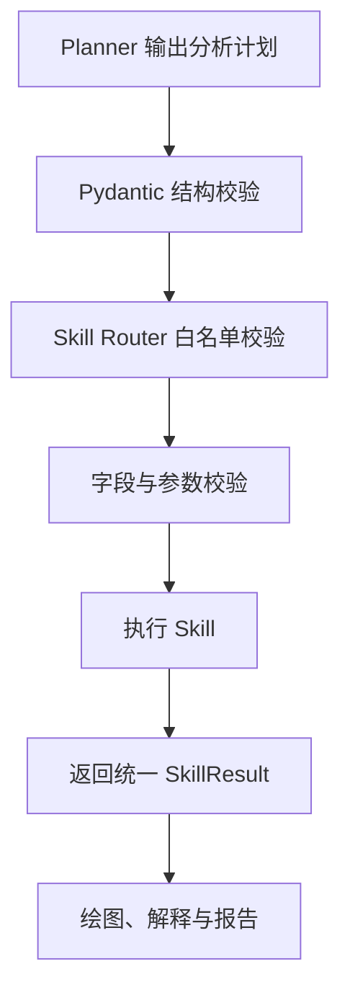

# Research Analysis Agent Skill 输入输出规范

## 1. 文档目的

本文档规定 Research Analysis Agent 中各类 Skill 的职责、调用方式、输入参数、输出结构、校验规则和异常格式，是 Agent 调度层、Skill 工具层、报告模块及测试代码共同遵循的接口规范。

本项目中的 Skill 是可由 Agent 调用的 Python 功能模块。其设计遵循以下原则：

1. **LLM 负责规划与解释，Skill 负责真实计算。**
2. **Skill Router 只能调用白名单中已注册的 Skill。**
3. **统计结果必须由 pandas、NumPy、SciPy 或 statsmodels 等库计算，LLM 不得生成或修改统计数值。**
4. **相同输入和参数应得到可重复的结果。**
5. **跨模块传递的数据必须可以转换为 JSON。**
6. **每个 Skill 只承担一种明确职责，不直接依赖 FastAPI、React 或前端状态。**

第一版支持数据读取、数据画像、基础清洗、方法选择、描述性统计、相关分析、独立样本 t 检验、单因素方差分析、线性回归、可视化和 Markdown 报告生成。

---

## 2. Skill 分类与注册名称

Skill Router 使用 `skill_name` 作为唯一注册名称，不允许使用文件路径或由 LLM 临时生成的函数名称。

| 分类 | `skill_name` | 实现文件 | 主要职责 |
|---|---|---|---|
| 数据处理 | `data_loader` | `skills/data/loader.py` | 读取 CSV、XLS、XLSX 文件 |
| 数据处理 | `data_profiler` | `skills/data/profiler.py` | 生成字段、缺失值和样本概况 |
| 数据处理 | `data_cleaner` | `skills/data/cleaner.py` | 完成基础缺失值、重复值清洗 |
| 方法选择 | `method_selector` | `skills/selector/method_selector.py` | 根据问题和字段类型推荐统计方法 |
| 统计分析 | `descriptive` | `skills/statistics/descriptive.py` | 描述性统计 |
| 统计分析 | `correlation` | `skills/statistics/correlation.py` | 相关分析 |
| 统计分析 | `t_test` | `skills/statistics/t_test.py` | 独立样本 t 检验 |
| 统计分析 | `anova` | `skills/statistics/anova.py` | 单因素方差分析 |
| 统计分析 | `regression` | `skills/statistics/regression.py` | 线性或多元线性回归 |
| 可视化 | `figure_generator` | `skills/visualization/figure_generator.py` | 生成并保存统计图表 |
| 结果解释 | `result_interpreter` | `skills/report/result_interpreter.py` | 调用 LLM 解释既有统计结果 |
| 报告生成 | `report_generator` | `skills/report/report_generator.py` | 生成 Markdown 报告 |
| 计算资源 | `resource_selector` | `skills/compute/resource_selector.py` | 判断使用本地或 HPC 资源 |
| 计算资源 | `hpc_submit` | `skills/compute/hpc_submit.py` | 第一版仅提供模拟提交接口 |

`skill_name` 一旦被 API、测试或报告引用，不得随意修改；如需升级行为，应修改 `skill_version`。

---

## 3. 通用调用流程



调用方不得把 Planner 输出直接传入 `eval()`、`exec()` 或任意动态 Python 代码执行环境。所有字段名、方法名和参数必须先通过白名单与业务规则校验。

---

## 4. 通用输入结构 `SkillRequest`

除底层辅助函数外，由 Agent 调用的公开 Skill 统一接收以下逻辑结构：

```json
{
  "task_id": "task_20260809_a1b2c3",
  "skill_name": "anova",
  "data_path": "outputs/uploads/task_20260809_a1b2c3/cleaned.csv",
  "params": {
    "target_column": "yield",
    "group_column": "fertilizer",
    "alpha": 0.05
  }
}
```

| 字段 | 类型 | 必填 | 说明 |
|---|---|---:|---|
| `task_id` | `string` | 是 | 当前分析任务的唯一标识 |
| `skill_name` | `string` | 是 | 必须是已注册的白名单名称 |
| `data_path` | `string \| null` | 视情况 | 数据类、统计类和绘图类 Skill 必填 |
| `params` | `object` | 是 | 当前 Skill 的专用参数，无参数时传 `{}` |

### 4.1 通用输入约束

- `task_id` 只能包含字母、数字、下划线和连字符。
- `data_path` 必须位于项目允许的数据目录中，禁止使用 `..` 绕过目录限制。
- Skill 只接收字段名称，不接收由 LLM 生成的 pandas 表达式或 Python 代码。
- 未在当前 Skill 参数表中声明的字段默认拒绝，避免拼写错误被静默忽略。
- `alpha` 默认值为 `0.05`，有效范围为 `0 < alpha < 1`。
- 列名必须与数据集真实列名完全一致；第一版不自动进行模糊匹配。

### 4.2 Python 接口建议

各公开 Skill 建议统一暴露：

```python
def run(request: SkillRequest) -> SkillResult:
    """校验输入、执行功能并返回统一结果。"""
```

模块内部可以继续拆分辅助函数，但 `skill_router.py` 只调用公开的 `run()` 接口。

---

## 5. 通用输出结构 `SkillResult`

所有公开 Skill 必须返回统一结构，不应直接把 pandas `DataFrame`、NumPy 数组或异常对象返回给 Agent。

```json
{
  "skill_name": "anova",
  "skill_version": "1.0.0",
  "status": "success",
  "summary": {
    "f_statistic": 8.42,
    "p_value": 0.003,
    "alpha": 0.05,
    "significant": true
  },
  "tables": [],
  "figures": [],
  "artifacts": [],
  "warnings": [],
  "metadata": {
    "n_input": 90,
    "n_used": 87,
    "n_dropped": 3,
    "duration_ms": 31
  },
  "error": null
}
```

| 字段 | 类型 | 必填 | 说明 |
|---|---|---:|---|
| `skill_name` | `string` | 是 | 当前实际执行的 Skill 名称 |
| `skill_version` | `string` | 是 | 语义化版本号，第一版统一为 `1.0.0` |
| `status` | `string` | 是 | `success`、`warning` 或 `failed` |
| `summary` | `object` | 是 | 供 Agent 和前端快速读取的核心结果 |
| `tables` | `array` | 是 | 结构化表格列表 |
| `figures` | `array` | 是 | 图表信息列表；未绘图时为空数组 |
| `artifacts` | `array` | 是 | 清洗后数据、报告等产物列表 |
| `warnings` | `array` | 是 | 不阻止执行但需向用户说明的问题 |
| `metadata` | `object` | 是 | 样本数、耗时、实际参数等辅助信息 |
| `error` | `object \| null` | 是 | 失败时为错误对象，否则为 `null` |

### 5.1 状态定义

| `status` | 含义 |
|---|---|
| `success` | Skill 正常执行，未发现重要风险 |
| `warning` | 已产生可用结果，但存在缺失删除、假设风险或其他限制 |
| `failed` | 未产生可信结果，调用方必须停止依赖该结果的后续步骤 |

### 5.2 表格格式

```json
{
  "name": "group_summary",
  "title": "各组描述性统计",
  "columns": ["group", "count", "mean", "std"],
  "rows": [
    {"group": "A", "count": 30, "mean": 21.4, "std": 2.8},
    {"group": "B", "count": 29, "mean": 24.1, "std": 3.0}
  ]
}
```

### 5.3 图表格式

```json
{
  "name": "anova_boxplot",
  "chart_type": "boxplot",
  "title": "不同肥料组的产量分布",
  "path": "outputs/figures/task_20260809_a1b2c3/anova_boxplot.png",
  "mime_type": "image/png"
}
```

### 5.4 产物格式

```json
{
  "name": "report",
  "type": "markdown",
  "path": "outputs/reports/task_20260809_a1b2c3/report.md"
}
```

### 5.5 JSON 序列化规则

- NumPy 整数和浮点数必须转换为 Python `int` 和 `float`。
- `NaN`、正无穷和负无穷统一转换为 `null`，并在 `warnings` 中说明。
- 时间统一使用 ISO 8601 字符串。
- 对外结果中的路径使用相对项目根目录的路径，并统一使用 `/`。
- 计算过程中保留完整精度；展示层可将浮点数格式化为 4 位小数。
- `p_value` 很小时不得直接写成 `0`，应保留科学计数值；前端可显示为 `p < 0.0001`。

---

## 6. 警告与错误规范

### 6.1 警告对象

```json
{
  "code": "ASSUMPTION_VIOLATION",
  "message": "Levene 检验提示各组方差可能不齐。",
  "details": {"test": "levene", "p_value": 0.012}
}
```

### 6.2 错误对象

```json
{
  "code": "COLUMN_NOT_FOUND",
  "message": "数据集中不存在字段 yield。",
  "details": {"column": "yield"},
  "retryable": false
}
```

### 6.3 标准错误码

| 错误码 | 适用场景 |
|---|---|
| `INVALID_REQUEST` | 通用请求结构不完整或类型错误 |
| `SKILL_NOT_ALLOWED` | `skill_name` 不在白名单中 |
| `UNSUPPORTED_FILE_TYPE` | 文件不是 CSV、XLS 或 XLSX |
| `FILE_NOT_FOUND` | 数据文件不存在 |
| `FILE_TOO_LARGE` | 文件超过系统限制 |
| `FILE_READ_ERROR` | 编码错误、Excel 损坏或其他读取失败 |
| `EMPTY_DATASET` | 数据集没有有效行或列 |
| `COLUMN_NOT_FOUND` | 指定字段不存在 |
| `INVALID_COLUMN_TYPE` | 字段类型不符合统计方法要求 |
| `INSUFFICIENT_SAMPLE_SIZE` | 有效样本不足 |
| `INVALID_GROUP_COUNT` | 分组数量不符合方法要求 |
| `INVALID_PARAMETER` | 参数超出范围或组合冲突 |
| `CONSTANT_COLUMN` | 参与计算的字段没有变异 |
| `SINGULAR_MATRIX` | 回归矩阵不可逆或完全共线 |
| `COMPUTATION_ERROR` | 统计库计算失败 |
| `FIGURE_GENERATION_ERROR` | 绘图或图片保存失败 |
| `LLM_SERVICE_ERROR` | 解释阶段模型调用失败 |
| `LLM_OUTPUT_INVALID` | 模型返回格式不符合要求 |
| `REPORT_GENERATION_ERROR` | 报告生成或保存失败 |
| `RESOURCE_UNAVAILABLE` | 请求的计算资源不可用 |

Skill 内部应捕获可预期异常并转换为上述结构；完整堆栈只写入服务端日志，不返回前端。

---

## 7. 数据处理 Skill

### 7.1 `data_loader`

职责：安全读取 CSV、XLS 或 XLSX 文件，并返回数据集基本信息。DataFrame 只在后端进程内部使用，不直接进入 API 响应。

#### 参数

| 参数 | 类型 | 必填 | 默认值 | 说明 |
|---|---|---:|---|---|
| `sheet_name` | `string \| integer \| null` | 否 | `0` | Excel 工作表名称或序号 |
| `encoding` | `string \| null` | 否 | `null` | CSV 编码；为空时依次尝试 `utf-8-sig`、`utf-8`、`gb18030` |
| `delimiter` | `string \| null` | 否 | `null` | CSV 分隔符；为空时使用逗号或自动判断 |

#### `summary` 最少字段

```json
{
  "file_type": "csv",
  "row_count": 120,
  "column_count": 8,
  "columns": ["yield", "fertilizer", "temperature"]
}
```

#### 校验规则

- 后缀与实际文件类型均须通过检查。
- Excel 指定工作表不存在时返回 `FILE_READ_ERROR`。
- 空文件或只有表头时返回 `EMPTY_DATASET`。
- 不修改原始上传文件。

### 7.2 `data_profiler`

职责：读取数据并生成可供 Planner 使用的数据画像。

#### 参数

| 参数 | 类型 | 必填 | 默认值 | 说明 |
|---|---|---:|---|---|
| `sample_rows` | `integer` | 否 | `5` | 返回预览行数，范围 `1–20` |
| `top_categories` | `integer` | 否 | `10` | 分类型字段展示的高频值数量 |

#### `summary` 最少字段

```json
{
  "row_count": 120,
  "column_count": 3,
  "duplicate_rows": 2,
  "total_missing": 7,
  "columns": [
    {
      "name": "yield",
      "inferred_type": "numeric",
      "dtype": "float64",
      "non_null_count": 118,
      "missing_count": 2,
      "missing_rate": 0.0167,
      "unique_count": 104
    }
  ],
  "preview": []
}
```

`inferred_type` 仅允许：`numeric`、`categorical`、`datetime`、`text`、`boolean`、`unknown`。对象类型字段不能仅依据 pandas 的 `object` 类型直接判定，应结合唯一值数量和内容进行基础推断。

### 7.3 `data_cleaner`

职责：执行可追踪的基础清洗，并将结果保存为新文件；禁止覆盖用户的原始上传文件。

#### 参数

| 参数 | 类型 | 必填 | 默认值 | 说明 |
|---|---|---:|---|---|
| `columns` | `array[string] \| null` | 否 | `null` | 需要处理的列；为空表示全部列 |
| `drop_duplicates` | `boolean` | 否 | `true` | 是否删除完全重复行 |
| `missing_strategy` | `string` | 否 | `drop_required` | `drop_required`、`drop_rows`、`mean`、`median`、`mode` 或 `none` |
| `required_columns` | `array[string]` | 否 | `[]` | 分析必须使用的列 |
| `output_format` | `string` | 否 | `csv` | 第一版固定支持 `csv` |

`drop_required` 表示只删除 `required_columns` 中存在缺失值的行，是统计分析的推荐默认策略。均值和中位数只能用于数值列，众数可用于数值或分类型列。

#### `summary` 最少字段

```json
{
  "input_rows": 120,
  "output_rows": 115,
  "duplicates_removed": 2,
  "rows_removed_for_missing": 3,
  "values_imputed": 0,
  "operations": [
    "删除 2 行完全重复记录",
    "删除分析必需字段含缺失值的 3 行记录"
  ]
}
```

清洗结果保存至 `outputs/uploads/{task_id}/cleaned.csv`，并通过 `artifacts` 返回路径。

---

## 8. 方法选择 Skill

### 8.1 `method_selector`

职责：根据用户问题、数据画像和显式指定的字段，通过规则推荐统计方法。该模块可以接收 Planner 的建议，但最终推荐必须通过字段规则验证。

#### 参数

```json
{
  "question": "不同肥料组的作物产量是否存在显著差异？",
  "target_column": "yield",
  "group_column": "fertilizer",
  "feature_columns": [],
  "planner_suggestion": "anova"
}
```

#### 选择规则

| 数据关系 | 返回的 `recommended_method` |
|---|---|
| 单个或多个字段的分布、均值、频数等概况 | `descriptive` |
| 两个或多个数值型变量的关联 | `correlation` |
| 一个数值型因变量与一个恰好含两组的分类型变量 | `t_test` |
| 一个数值型因变量与一个含三组及以上的分类型变量 | `anova` |
| 一个数值型因变量与一个或多个数值型解释变量 | `regression` |

#### `summary` 最少字段

```json
{
  "recommended_method": "anova",
  "confidence": "high",
  "reason": "目标字段 yield 为数值型，分组字段 fertilizer 含 3 个类别。",
  "validated_columns": ["yield", "fertilizer"],
  "required_params": ["target_column", "group_column"]
}
```

`confidence` 仅允许 `high`、`medium`、`low`。若信息不足，不得猜测字段，应返回 `status: "failed"` 和具体缺失信息。

---

## 9. 统计分析 Skill 通用规则

所有统计 Skill 均须：

1. 检查字段是否存在以及类型是否正确。
2. 仅在分析相关字段上处理缺失值，并报告 `n_input`、`n_used` 和 `n_dropped`。
3. 在计算前检查常数列、无穷值和有效样本量。
4. 返回原假设、备择假设、核心统计量、p 值和显著性判断。
5. 将统计假设检查作为辅助信息；假设不满足时返回警告，不得悄悄忽略。
6. 不把“统计显著”表述为“影响很大”或“存在因果关系”。
7. 默认不在统计 Skill 内生成图片，由 `figure_generator` 读取数据和统计结果生成图表。

显著性统一计算为：

```python
significant = p_value < alpha
```

不要使用 `p_value <= alpha`，以避免各模块判断不一致。

---

## 10. 描述性统计 `descriptive`

### 参数

| 参数 | 类型 | 必填 | 默认值 | 说明 |
|---|---|---:|---|---|
| `columns` | `array[string]` | 是 | — | 要分析的字段，至少一个 |
| `group_by` | `string \| null` | 否 | `null` | 可选分组字段 |
| `include_percentiles` | `boolean` | 否 | `true` | 是否返回四分位数 |

### 输出要求

- 数值型字段：`count`、`missing`、`mean`、`std`、`min`、`q1`、`median`、`q3`、`max`。
- 分类型字段：`count`、`missing`、`unique`、`mode`、`mode_frequency`。
- `tables` 至少包含 `descriptive_statistics`。
- 使用 `group_by` 时，必须同时给出每组有效样本量。

### 最低样本要求

单个字段至少存在 1 个非缺失值；标准差无法计算时返回 `null` 和警告。

---

## 11. 相关分析 `correlation`

### 参数

| 参数 | 类型 | 必填 | 默认值 | 说明 |
|---|---|---:|---|---|
| `columns` | `array[string]` | 是 | — | 至少两个数值型字段 |
| `method` | `string` | 否 | `pearson` | `pearson`、`spearman` 或 `kendall` |
| `alpha` | `float` | 否 | `0.05` | 显著性水平 |
| `missing` | `string` | 否 | `pairwise` | `pairwise` 或 `listwise` |
| `min_periods` | `integer` | 否 | `3` | 每对变量最少有效样本数 |

### `summary` 最少字段

```json
{
  "method": "pearson",
  "alpha": 0.05,
  "variable_count": 3,
  "strongest_pair": {
    "x": "temperature",
    "y": "yield",
    "coefficient": 0.72,
    "p_value": 0.0002,
    "significant": true
  }
}
```

### 表格要求

- `correlation_matrix`：相关系数矩阵。
- `p_value_matrix`：双侧检验 p 值矩阵。
- `pairwise_results`：每一对字段的系数、p 值、样本数和显著性。

常数列无法计算相关系数时，不得伪造为 `0`；应返回 `null` 并产生 `CONSTANT_COLUMN` 警告。相关分析只能说明关联，不能直接说明因果。

---

## 12. 独立样本 t 检验 `t_test`

### 参数

| 参数 | 类型 | 必填 | 默认值 | 说明 |
|---|---|---:|---|---|
| `target_column` | `string` | 是 | — | 数值型因变量 |
| `group_column` | `string` | 是 | — | 恰好包含两个有效类别的分组字段 |
| `groups` | `array[any] \| null` | 否 | `null` | 明确指定参与比较的两个类别 |
| `equal_var` | `boolean \| string` | 否 | `auto` | `true`、`false` 或 `auto` |
| `alternative` | `string` | 否 | `two-sided` | `two-sided`、`less` 或 `greater` |
| `alpha` | `float` | 否 | `0.05` | 显著性水平 |

当 `equal_var="auto"` 时，先执行 Levene 检验：若其 p 值小于 `alpha`，使用 Welch t 检验；否则使用等方差独立样本 t 检验。必须在结果中记录实际使用的方法。

### `summary` 最少字段

```json
{
  "test": "welch_t_test",
  "group_1": "A",
  "group_2": "B",
  "mean_1": 21.4,
  "mean_2": 24.1,
  "mean_difference": -2.7,
  "t_statistic": -3.52,
  "degrees_of_freedom": 55.8,
  "p_value": 0.0009,
  "alpha": 0.05,
  "significant": true,
  "cohens_d": -0.91
}
```

### 表格要求

- `group_summary`：两组的样本量、均值、标准差和标准误。
- `assumption_tests`：至少包含 Levene 检验结果。

### 最低样本要求

每组至少 2 个有效观测；少于 3 个时即使可计算，也应返回样本量过小警告。若未指定 `groups` 且有效类别不等于 2，返回 `INVALID_GROUP_COUNT`。

---

## 13. 单因素方差分析 `anova`

### 参数

| 参数 | 类型 | 必填 | 默认值 | 说明 |
|---|---|---:|---|---|
| `target_column` | `string` | 是 | — | 数值型因变量 |
| `group_column` | `string` | 是 | — | 至少包含两个有效类别的分组字段 |
| `alpha` | `float` | 否 | `0.05` | 显著性水平 |
| `posthoc` | `string` | 否 | `tukey` | `tukey` 或 `none` |
| `include_assumption_tests` | `boolean` | 否 | `true` | 是否执行方差齐性和组内正态性检查 |

### `summary` 最少字段

```json
{
  "test": "one_way_anova",
  "f_statistic": 8.42,
  "df_between": 2,
  "df_within": 84,
  "p_value": 0.003,
  "alpha": 0.05,
  "significant": true,
  "eta_squared": 0.167
}
```

### 表格要求

- `group_summary`：各组样本量、均值、标准差。
- `anova_table`：组间、组内和总变异的自由度、平方和、均方、F 值及 p 值。
- `assumption_tests`：Levene 检验和可执行时的组内 Shapiro-Wilk 检验。
- `posthoc_tukey`：仅在总体检验显著且 `posthoc="tukey"` 时返回。

### 最低样本要求

至少两个有效组且每组至少 2 个有效观测。组数为 2 时可以执行 ANOVA，但 `method_selector` 默认推荐 t 检验。方差齐性明显不满足时返回警告，并在报告中建议考虑 Welch ANOVA 作为后续扩展；第一版不自动切换方法。

---

## 14. 线性回归 `regression`

第一版实现普通最小二乘法（OLS），支持一个或多个数值型解释变量。分类型解释变量的自动编码不属于第一版默认范围。

### 参数

| 参数 | 类型 | 必填 | 默认值 | 说明 |
|---|---|---:|---|---|
| `target_column` | `string` | 是 | — | 数值型因变量 |
| `feature_columns` | `array[string]` | 是 | — | 至少一个数值型解释变量 |
| `add_constant` | `boolean` | 否 | `true` | 是否加入截距项 |
| `alpha` | `float` | 否 | `0.05` | 系数置信区间与显著性水平 |
| `standardize` | `boolean` | 否 | `false` | 是否在拟合前标准化解释变量 |

### `summary` 最少字段

```json
{
  "model": "ols",
  "n_observations": 115,
  "r_squared": 0.68,
  "adjusted_r_squared": 0.66,
  "f_statistic": 38.2,
  "f_p_value": 0.000001,
  "rmse": 2.14,
  "aic": 318.4,
  "bic": 329.1
}
```

### 表格要求

- `coefficients`：变量名、系数、标准误、t 值、p 值及置信区间。
- `model_metrics`：R²、调整 R²、RMSE、AIC、BIC、F 统计量及其 p 值。
- `diagnostics`：至少返回 Durbin-Watson、残差正态性检验以及各解释变量 VIF（单解释变量时 VIF 可省略）。

### 校验与警告

- 因变量和解释变量必须为数值型。
- 有效样本量必须大于估计参数数量；建议至少为估计参数数量的 5 倍，否则产生样本不足警告。
- 常数解释变量返回 `CONSTANT_COLUMN`。
- 完全共线导致无法稳定估计时返回 `SINGULAR_MATRIX`。
- `VIF > 5` 产生多重共线性警告，`VIF > 10` 产生严重警告。
- 回归关系不自动解释为因果关系。

---

## 15. 可视化 Skill `figure_generator`

职责：根据分析类型、字段和已计算结果生成图表。该 Skill 只负责展示，不重新定义或修改统计结论。

### 参数

| 参数 | 类型 | 必填 | 默认值 | 说明 |
|---|---|---:|---|---|
| `analysis_type` | `string` | 是 | — | 对应统计 Skill 名称 |
| `chart_type` | `string \| null` | 否 | `null` | 为空时使用默认图表 |
| `columns` | `array[string]` | 否 | `[]` | 普通绘图字段 |
| `target_column` | `string \| null` | 否 | `null` | 因变量 |
| `group_column` | `string \| null` | 否 | `null` | 分组变量 |
| `feature_columns` | `array[string]` | 否 | `[]` | 回归解释变量 |
| `title` | `string \| null` | 否 | `null` | 自定义标题 |
| `dpi` | `integer` | 否 | `150` | 图片分辨率，范围 `72–300` |

### 默认图表

| `analysis_type` | 默认图表 |
|---|---|
| `descriptive` | 数值字段直方图；分类字段条形图 |
| `correlation` | 两变量散点图；三变量及以上相关系数热力图 |
| `t_test` | 两组箱线图 |
| `anova` | 多组箱线图 |
| `regression` | 单解释变量拟合图；所有回归均生成残差图 |

图表统一保存至 `outputs/figures/{task_id}/`，文件名只使用小写字母、数字和下划线。保存成功后必须关闭 Matplotlib figure，防止批量任务占用内存。

---

## 16. 结果解释 `result_interpreter`

该模块会调用 LLM，因此它不是确定性的统计计算模块。它只能消费已经生成的 `SkillResult`，不得重新计算或改写其中的数值。

### 参数

```json
{
  "question": "不同肥料组的作物产量是否存在显著差异？",
  "analysis_plan": {},
  "profile_summary": {},
  "statistical_result": {},
  "language": "zh-CN"
}
```

### `summary` 最少字段

```json
{
  "method_explanation": "本次使用单因素方差分析比较多个独立组的均值。",
  "key_findings": ["不同肥料组的平均产量存在统计显著差异。"],
  "limitations": ["统计显著不等同于因果关系。"],
  "plain_language_conclusion": "在当前样本中，不同肥料组的产量表现并不完全相同。"
}
```

### 约束

- 提示词必须明确要求模型引用提供的数值，禁止自行补充不存在的数值。
- 统计 Skill 失败时不得请求模型编造解释。
- LLM 调用失败不影响已完成的统计结果，应返回 `LLM_SERVICE_ERROR`，并允许报告使用模板化说明继续生成。
- 涉及显著性时必须同时参考 `p_value` 和 `alpha`。
- 不得把相关关系或观察性回归写成因果关系。

---

## 17. 报告生成 `report_generator`

职责：将用户问题、数据画像、清洗记录、分析计划、统计结果、图表、解释与限制组合为 Markdown 文件。

### 参数

| 参数 | 类型 | 必填 | 说明 |
|---|---|---:|---|
| `question` | `string` | 是 | 用户原始问题 |
| `profile_result` | `object` | 是 | 数据画像结果 |
| `cleaning_result` | `object \| null` | 否 | 数据清洗记录 |
| `analysis_plan` | `object` | 是 | 已校验的分析计划 |
| `statistical_results` | `array[object]` | 是 | 一个或多个统计 Skill 结果 |
| `interpretation` | `object \| null` | 否 | LLM 解释结果 |
| `figures` | `array[object]` | 否 | 图表列表 |

### 报告固定章节

1. 分析问题
2. 数据集概况
3. 数据清洗说明
4. 分析计划
5. 分析方法与适用条件
6. 统计结果
7. 可视化图表
8. 结果解释
9. 警告与分析限制

报告保存至 `outputs/reports/{task_id}/report.md`。报告模块只格式化已有结果，不重新执行统计计算。图片使用相对于报告文件可访问的路径，生成后应检查所有引用的图片文件是否存在。

---

## 18. 计算资源 Skill

### 18.1 `resource_selector`

第一版所有真实任务均在本地执行，但保留资源选择结果用于展示系统扩展能力。

#### 参数

```json
{
  "row_count": 120,
  "column_count": 8,
  "analysis_type": "anova",
  "estimated_memory_mb": 5
}
```

#### 输出

```json
{
  "selected_resource": "local",
  "reason": "数据规模较小，适合本地执行。",
  "hpc_required": false
}
```

### 18.2 `hpc_submit`

第一版不得真正连接集群。调用时返回：

```json
{
  "status": "warning",
  "summary": {
    "submitted": false,
    "mode": "mock",
    "message": "第一版尚未接入 HPC，任务将回退至本地执行。"
  }
}
```

---

## 19. Skill Router 注册约定

`backend/agent/skill_router.py` 应显式维护注册表：

```python
SKILL_REGISTRY = {
    "data_loader": "skills.data.loader",
    "data_profiler": "skills.data.profiler",
    "data_cleaner": "skills.data.cleaner",
    "method_selector": "skills.selector.method_selector",
    "descriptive": "skills.statistics.descriptive",
    "correlation": "skills.statistics.correlation",
    "t_test": "skills.statistics.t_test",
    "anova": "skills.statistics.anova",
    "regression": "skills.statistics.regression",
    "figure_generator": "skills.visualization.figure_generator",
    "result_interpreter": "skills.report.result_interpreter",
    "report_generator": "skills.report.report_generator",
    "resource_selector": "skills.compute.resource_selector",
    "hpc_submit": "skills.compute.hpc_submit",
}
```

注册表必须由开发者维护，不接受 Planner 在运行时新增条目。Router 在调用前依次检查：

1. `skill_name` 是否注册；
2. 请求结构是否有效；
3. 数据文件是否属于当前 `task_id`；
4. 字段是否存在；
5. 参数是否满足该 Skill 约束；
6. 执行结果是否符合 `SkillResult`。

---

## 20. 日志与可追踪性

每次 Skill 调用至少记录以下内容：

| 字段 | 说明 |
|---|---|
| `task_id` | 所属任务 |
| `skill_name` | 调用的 Skill |
| `skill_version` | Skill 版本 |
| `started_at` | 开始时间 |
| `finished_at` | 结束时间 |
| `duration_ms` | 执行耗时 |
| `status` | 执行状态 |
| `input_columns` | 参与分析的字段名，不记录完整数据内容 |
| `error_code` | 失败时的标准错误码 |

日志不得记录 API Key，也不应默认记录用户数据的完整行内容。

---

## 21. 测试与验收标准

每个 Skill 至少编写以下测试：

1. **正常输入测试**：验证核心数值和输出结构。
2. **字段不存在测试**：应返回 `COLUMN_NOT_FOUND`。
3. **字段类型错误测试**：应返回 `INVALID_COLUMN_TYPE`。
4. **缺失值测试**：验证有效样本量与警告内容。
5. **样本不足测试**：应拒绝产生不可信结果。
6. **常数列测试**：相关或回归不得输出伪造结果。
7. **JSON 序列化测试**：输出不得包含 NumPy 类型、`NaN` 或异常对象。

统计结果应使用人工可验证的小型数据或对应统计库的直接计算结果进行断言。浮点数测试使用合理容差，不直接比较字符串化结果。

### 第一版端到端验收示例

使用 `examples/fertilizer_anova/fertilizer.csv` 和问题“不同肥料组的作物产量是否存在显著差异？”完成以下闭环：

1. 成功读取并生成数据画像；
2. 方法选择结果为 `anova`；
3. 返回分组统计、ANOVA 表、F 值、p 值和效应量；
4. 生成多组箱线图；
5. 生成不篡改统计数值的中文解释；
6. 生成包含固定九个章节的 Markdown 报告；
7. 所有结果均能被 FastAPI 响应模型序列化。

---

## 22. 第一版范围边界

第一版明确不支持：

- 配对样本 t 检验、重复测量 ANOVA、Welch ANOVA；
- 广义线性模型、时间序列模型和复杂机器学习训练；
- 自动执行任意 Python 代码；
- 由 LLM 自行创建新 Skill；
- 自动将分类型变量编码后放入回归模型；
- 真正的 HPC 集群提交；
- PDF、Word 等非结构化文档分析。

当用户需求超出范围时，系统应返回清晰说明和可选的已支持方法，不得静默替换成不等价的统计分析。

---

## 23. 版本管理

本文档对应 Skill 接口版本 `1.0.0`。版本更新遵循：

- 修正文案或增加可选说明：补丁版本，例如 `1.0.1`；
- 增加向后兼容的可选参数或结果字段：次版本，例如 `1.1.0`；
- 删除字段、改变字段类型或修改统计含义：主版本，例如 `2.0.0`。

任何破坏兼容性的修改，都必须同时更新：

- `docs/skill_spec.md`
- `backend/agent/skill_router.py`
- `backend/schemas/`
- 对应 Skill 的单元测试
- 使用该结果的报告和前端组件

